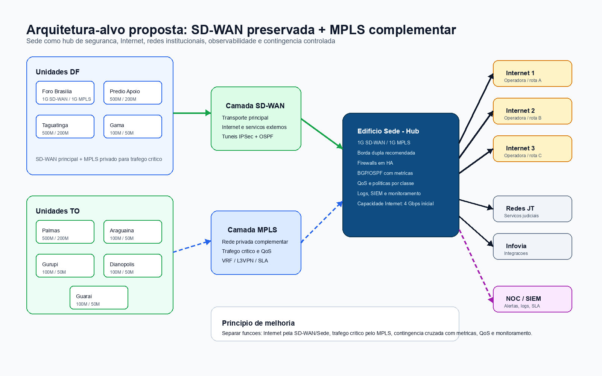
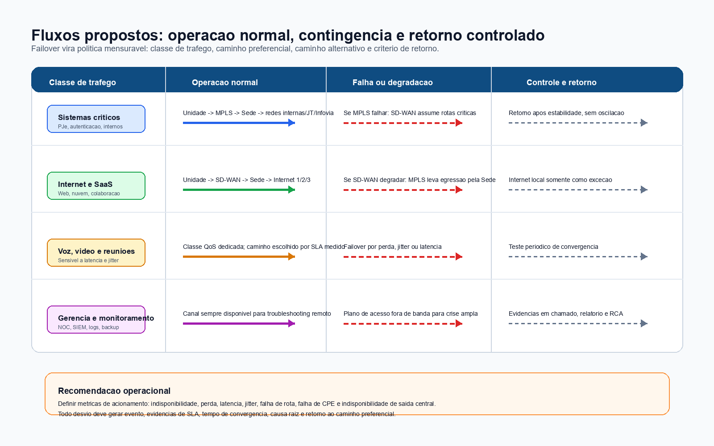
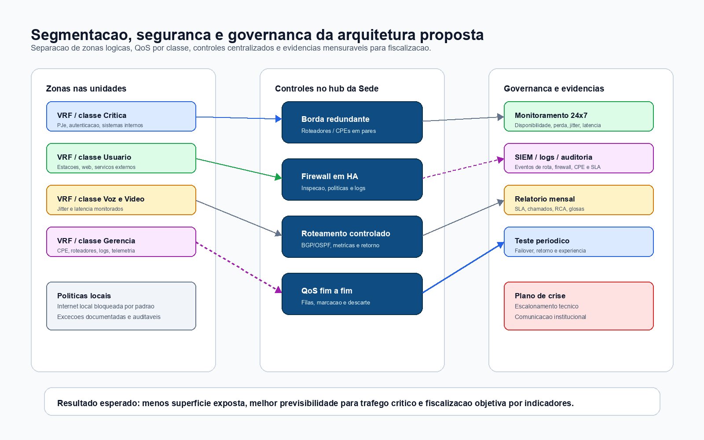

# ESTUDO TECNICO PRELIMINAR (ETP)

**Objeto:** Contratacao complementar de servicos continuados de comunicacao de dados por MPLS, de menor capacidade em relacao aos enlaces SD-WAN atuais, para interconexao das unidades do TRT10 a Sede, em arquitetura hibrida integrada com a SD-WAN vigente.  
**Unidade demandante:** Coordenadoria de Infraestrutura de Tecnologia - CDTEC  
**Orgao:** Tribunal Regional do Trabalho da 10a Regiao - TRT10  
**Processo de referencia:** SEI 0009785-67.2025.5.10.8000  
**Versao:** Nova versao com arquitetura de solucao aprimorada  
**Data:** 23/05/2026

## Registro de Evidencias e Premissas

### Fatos recuperados dos documentos anexados

- O modelo de ETP anexo estrutura o estudo em descricao da necessidade, alinhamento estrategico, requisitos, levantamento de mercado, descricao da solucao, estimativas, justificativa de parcelamento, resultados esperados, providencias previas, contratacoes correlatas, impactos ambientais e posicionamento conclusivo.
- O processo SEI 0000030-87.2023.5.10.8000 registra contratacao de Link IP dedicado com SD-WAN para 10 localidades, com bandas de 1 Gbps na Sede e Foro de Brasilia, 500 Mbps em Taguatinga, Palmas e Predio de Apoio, e 100 Mbps nas demais localidades.
- O mesmo processo registra disponibilidade minima de 99,90% para Sede e 99,70% para as demais localidades, e vigencia inicial de 5 anos.
- Contratacoes anteriores de Internet com Anti-DDoS registram a relevancia de redundancia, operadoras distintas, monitoramento, portal de chamados, glosas por indisponibilidade e teste de aceite.
- Documentos anteriores indicam que Foro de Brasilia e Predio de Apoio ja se conectavam a Sede via MPLS e Infovia, evidenciando aderencia historica da arquitetura de concentracao na Sede.
- O DFD revisado do processo SEI 0009785-67.2025.5.10.8000 consolida a manutencao da topologia SD-WAN atual e a contratacao complementar de MPLS, com interconexao das demais localidades a Sede e saida de Internet preferencialmente centralizada na Sede.
- O DFD revisado registra que a topologia SD-WAN atual se baseia em enlaces dedicados, tuneis IPSec, roteamento dinamico OSPF e concentracao em pontos centrais, devendo ser preservada durante a implantacao dos links MPLS.
- O DFD revisado indica, como premissa a validar, que a Sede devera dispor de 3 links de Internet redundantes, preferencialmente com operadoras e rotas fisicas distintas, com capacidade combinada suficiente para suportar a agregacao do trafego das unidades.
- A base local da skill `etp-nagem-v2` nao retornou precedentes PNCP uteis para a busca "links MPLS / comunicacao de dados / rede corporativa", razao pela qual esta minuta se apoia nos documentos anexos e em inferencias tecnicas marcadas.

### Inferencias analiticas

- A contratacao de MPLS nao substitui a SD-WAN atual; ela cria camada privada complementar para trafego critico, enquanto a SD-WAN permanece como camada preferencial para Internet.
- As capacidades MPLS propostas sao dimensionamento preliminar e devem ser confirmadas por medicao real de trafego e pesquisa de mercado.
- A existencia de 3 saidas de Internet redundantes na Sede permite centralizar a egressao de Internet e aplicar politicas uniformes de seguranca.
- A capacidade minima combinada de 4 Gbps para as 3 saidas de Internet da Sede constitui premissa tecnica conservadora, derivada da soma aproximada dos enlaces SD-WAN atuais, e deve ser validada por medicao de uso, picos, simultaneidade, politica de degradacao controlada e pesquisa de mercado.
- A arquitetura mais resiliente e a que permite contingencia cruzada: MPLS pode transportar trafego de Internet em caso de falha da SD-WAN, e SD-WAN pode transportar trafego critico em caso de falha do MPLS.

## I - Descricao da Necessidade de Contratacao

### 1.1 Necessidade da Administracao

O TRT10 necessita contratar servicos de comunicacao de dados MPLS para interconectar suas unidades a Sede, de modo a prover uma camada privada, previsivel, monitoravel e resiliente para trafego institucional critico.

A necessidade decorre do aumento da dependencia dos servicos digitais, da centralizacao de seguranca e saida de Internet na Sede, da necessidade de redundancia em relacao a SD-WAN atual e da conveniencia de manter trafego sensivel em rede privada, com QoS, segregacao logica e controle de rotas. A arquitetura pretendida separa os fluxos por finalidade: MPLS para sistemas criticos e comunicacao corporativa interna; SD-WAN para Internet; e uso reciproco dos meios em contingencia.

A revisao da demanda preserva os enlaces SD-WAN ja implantados, com suas capacidades atuais e tunelamento IPSec, e acrescenta camada MPLS complementar de menor capacidade para todas as localidades. Com isso, evita-se a substituicao integral da arquitetura existente e reduz-se a necessidade de contratacao duplicada de enlaces de Internet dedicados de alta capacidade em todas as unidades.

A Sede devera operar como concentrador preferencial de saida de Internet, seguranca, observabilidade e integracao com redes institucionais, considerando a existencia de 3 saidas de Internet redundantes. A saida local de Internet pelas unidades devera ser tratada como excecao tecnica, contingencia ou fluxo formalmente autorizado, conforme politica definida no projeto executivo.

### 1.1.1 Quais as especificacoes minimas do objeto da contratacao para que a necessidade da Administracao possa ser satisfatoriamente atendida?

Para que a necessidade da Administracao seja atendida de forma satisfatoria, o objeto devera contemplar uma solucao continuada de comunicacao de dados corporativa, em rede privada MPLS L3 VPN ou tecnologia funcionalmente equivalente, capaz de interconectar todas as unidades do TRT10 a Sede, preservar a convivencia com a SD-WAN existente e permitir operacao com preferencia de trafego e contingencia cruzada.

As especificacoes minimas abaixo constituem hipotese tecnica de trabalho para o ETP e deverao ser refinadas no Termo de Referencia, no projeto executivo e na pesquisa de mercado.

#### a) Escopo minimo do servico

A contratacao devera incluir, no minimo:

- prestacao de servico continuado de comunicacao de dados por rede privada corporativa MPLS L3 VPN ou tecnologia equivalente;
- interconexao da Sede, Foro de Brasilia, Predio de Apoio, Foro de Taguatinga, Foro de Palmas, Vara do Gama, Foro de Araguaina, Vara de Gurupi, Vara de Dianopolis e Vara de Guarai;
- fornecimento, instalacao, configuracao, ativacao, operacao, manutencao e suporte dos circuitos;
- fornecimento dos CPEs, roteadores, modems, transceptores, fontes, cabos, licencas e demais elementos necessarios a prestacao do servico, quando nao forem expressamente indicados como responsabilidade do TRT10;
- monitoramento 24x7 dos circuitos e equipamentos sob responsabilidade da contratada;
- central de atendimento, registro de chamados, escalonamento tecnico e relatorios mensais;
- documentacao tecnica inicial, documentacao as built e atualizacao apos mudancas relevantes.

#### b) Arquitetura minima

A solucao devera adotar topologia logica com a Sede como concentrador preferencial, mantendo todas as demais localidades interconectadas a Sede por MPLS. A Sede devera permanecer como ponto preferencial de saida de Internet e de aplicacao das politicas de seguranca, considerando a existencia de 3 saidas de Internet redundantes.

A arquitetura devera permitir:

- uso preferencial do MPLS para trafego critico, sistemas institucionais, autenticacao, servicos corporativos internos, administracao, monitoramento e integracoes;
- uso preferencial da SD-WAN para trafego de Internet e servicos externos;
- uso do MPLS para trafego de Internet em contingencia da SD-WAN, com egressao preferencial pela Sede;
- uso da SD-WAN para trafego critico em contingencia do MPLS;
- retorno controlado ao caminho preferencial apos normalizacao;
- capacidade agregada na Sede para suportar, em condicoes normais e em regime de contingencia controlada, a egressao de Internet das unidades;
- convivencia com firewalls, roteadores, controladores SD-WAN, redes JT, Infovia e demais componentes indicados pela CDTEC.

#### c) Capacidades minimas preliminares

As capacidades minimas preliminares deverao observar o dimensionamento abaixo, sujeito a validacao por medicao de trafego, criticidade, simultaneidade, crescimento esperado e pesquisa de mercado:

| Item | Localidade | Capacidade MPLS minima preliminar | Papel tecnico |
|---:|---|---:|---|
| 1 | Edificio Sede | 1 Gbps | Concentrador preferencial |
| 2 | Foro de Brasilia | 1 Gbps | Unidade de alta demanda |
| 3 | Predio de Apoio | 200 Mbps | Unidade metropolitana |
| 4 | Foro de Taguatinga | 200 Mbps | Unidade regional DF |
| 5 | Foro de Palmas | 200 Mbps | Polo regional TO |
| 6 | Vara do Gama | 50 Mbps | Unidade remota |
| 7 | Foro de Araguaina | 50 Mbps | Unidade remota |
| 8 | Vara de Gurupi | 50 Mbps | Unidade remota |
| 9 | Vara de Dianopolis | 50 Mbps | Unidade remota |
| 10 | Vara de Guarai | 50 Mbps | Unidade remota |

Os circuitos deverao ser simetricos, full duplex, com banda util compativel com a capacidade contratada, ressalvados apenas os overheads inerentes aos protocolos de comunicacao.

Como premissa para pesquisa de precos e validacao tecnica, as 3 saidas de Internet da Sede deverao ser dimensionadas para capacidade minima combinada de 4 Gbps em operacao normal, preferencialmente com operadoras e rotas fisicas distintas. Essa premissa nao substitui a medicao real de trafego, devendo ser ajustada conforme uso medio, picos, simultaneidade, criticidade dos servicos e politica de degradacao controlada.

#### c.1) Itens complementares a prever no TR

O Termo de Referencia devera avaliar a inclusao ou explicitacao dos seguintes itens complementares:

- 3 links de Internet centralizados e redundantes na Sede, preferencialmente com operadoras e rotas fisicas distintas;
- equipamentos de borda, roteadores, CPEs ou integracao com firewalls existentes, sem vinculacao a marca especifica;
- servicos de implantacao, configuracao, testes de aceite, documentacao e transferencia de conhecimento;
- monitoramento 24x7 dos links, alertas de indisponibilidade e relatorios mensais de SLA;
- suporte tecnico com prazos definidos para falha critica, degradacao e indisponibilidade;
- enderecamento, roteamento, QoS, segmentacao e politicas de seguranca documentadas no projeto executivo.

#### d) Roteamento, segregacao e QoS

A solucao devera suportar roteamento controlado e integracao com a infraestrutura existente do TRT10, preferencialmente por BGP ou OSPF, ou por roteamento estatico quando tecnicamente justificado. O projeto executivo devera definir rotas anunciadas, metricas, prioridades, contingencia, retorno ao caminho preferencial e prevencao de loops.

A solucao devera prover isolamento logico do trafego do TRT10, por VRF ou mecanismo equivalente, e suportar QoS com classes de servico configuraveis. Como referencia inicial, deverao ser previstas classes para:

- trafego critico de sistemas judiciais, autenticacao, servicos internos e administracao;
- trafego sensivel a tempo, como voz, video e colaboracao, quando aplicavel;
- trafego corporativo administrativo;
- trafego de melhor esforco.

As marcacoes, filas, percentuais de reserva e politicas de descarte deverao ser definidos no projeto executivo, sem exigencia de marca, fabricante ou tecnologia proprietaria especifica.

#### e) Disponibilidade, desempenho e suporte

Como requisito minimo preliminar, a solucao devera observar disponibilidade mensal de referencia de 99,90% para a Sede e 99,70% para as demais localidades, em coerencia com o historico da contratacao SD-WAN. As metas finais deverao ser confirmadas no Termo de Referencia.

O TR devera definir, de forma mensuravel:

- disponibilidade por circuito;
- prazo para inicio de atendimento;
- prazo de reparo por severidade;
- regras de manutencao programada;
- formula de calculo de disponibilidade;
- hipoteses de glosa;
- forma de afericao por relatorios da contratada e validacao da fiscalizacao;
- parametros de latencia, perda de pacotes e jitter, apos validacao de mercado.

#### f) Implantacao, testes e aceite

A contratada devera apresentar plano de implantacao antes da ativacao dos circuitos, contendo cronograma, prerequisitos, responsaveis, janelas de mudanca, testes, riscos e plano de rollback. A implantacao devera ocorrer preferencialmente por fases, iniciando pela Sede e pelas unidades de maior criticidade.

O aceite minimo por localidade devera verificar:

- identificacao do circuito;
- banda contratada;
- conectividade com a Sede;
- roteamento conforme projeto;
- acesso a servicos institucionais;
- registro no monitoramento;
- abertura de chamado teste;
- medicao inicial de latencia e perda;
- teste de contingencia entre MPLS e SD-WAN, quando tecnicamente aplicavel;
- entrega de documentacao as built.

#### g) Seguranca e confidencialidade

A contratada devera preservar o sigilo das informacoes de rede, enderecamento, rotas, configuracoes, chamados e incidentes. Devera manter controle de acesso administrativo aos equipamentos sob sua responsabilidade, registrar mudancas relevantes e comunicar incidentes que possam afetar disponibilidade, integridade, confidencialidade ou continuidade do servico.

#### h) Vedacao a direcionamento

As especificacoes deverao ser descritas por requisitos funcionais e de desempenho, sem indicacao de marca, fabricante, modelo ou solucao proprietaria especifica, salvo quando indispensavel e devidamente justificado. Devera ser admitida tecnologia equivalente ao MPLS quando demonstrada aderencia funcional aos requisitos de rede privada, isolamento, QoS, roteamento controlado, monitoramento e SLA.

### 1.1.2 Sera necessario exigir garantia contratual do objeto, complementar a legal?

Sim. Recomenda-se exigir garantia contratual do objeto durante toda a vigencia da contratacao, complementar as garantias legais aplicaveis, abrangendo o funcionamento dos circuitos, CPEs, roteadores, modems, fontes, transceptores, licencas, configuracoes, monitoramento, suporte tecnico e demais componentes fornecidos ou operados pela contratada.

A garantia do objeto devera assegurar que falhas, defeitos, indisponibilidades ou degradacoes imputaveis a contratada sejam corrigidos sem onus adicional para o TRT10, observados os prazos de atendimento, reparo, disponibilidade e demais niveis minimos de servico previstos no Termo de Referencia e no contrato.

Essa garantia do objeto nao substitui a garantia de execucao contratual eventualmente exigida, nem afasta a aplicacao de glosas, sancoes, obrigacoes de reparo, substituicao de equipamentos, manutencao corretiva ou demais medidas previstas no instrumento contratual.

### 1.1.3 A garantia contratual do objeto e compativel com as praticas de mercado?

Sim. A exigencia e compativel com as praticas de mercado para servicos continuados de telecomunicacoes e comunicacao de dados, nos quais e usual que a contratada se responsabilize pela disponibilidade do circuito, funcionamento dos equipamentos sob sua gestao, manutencao corretiva, substituicao de componentes defeituosos, suporte tecnico, monitoramento e cumprimento de SLA durante toda a vigencia contratual.

Tambem e pratica usual que equipamentos fornecidos em comodato, locacao, cessao de uso ou como parte indissociavel do servico sejam mantidos pela contratada, sem transferencia de responsabilidade tecnica ao contratante, salvo quando houver dano causado por uso indevido, caso fortuito, forca maior ou responsabilidade expressamente atribuida ao contratante no contrato.

### 1.2 Quais as caracteristicas minimas do modelo de execucao da contratacao para que a necessidade da Administracao possa ser satisfatoriamente atendida?

O modelo de execucao devera permitir implantacao controlada, operacao continuada, fiscalizacao objetiva e preservacao da conectividade atual durante a transicao. Para tanto, devera contemplar, no minimo:

- emissao de ordem de servico para inicio da execucao;
- apresentacao de plano de implantacao pela contratada em prazo definido no Termo de Referencia;
- levantamento inicial de prerequisitos por localidade, incluindo acesso fisico, energia, espaco, passagem de cabos, infraestrutura de fibra, CPEs e pontos de conexao;
- implantacao por fases, iniciando pela Sede e pelas unidades de maior criticidade ou maior capacidade;
- preservacao da SD-WAN vigente durante a implantacao do MPLS, evitando interrupcao dos servicos institucionais;
- entrega de projeto executivo antes da ativacao, contendo desenho logico, rotas, enderecamento, politicas de preferencia, QoS, contingencia, responsabilidades e rollback;
- ativacao e teste de aceite por localidade;
- operacao assistida apos a ativacao dos circuitos, com acompanhamento de estabilidade, roteamento, desempenho, chamados e relatorios;
- monitoramento 24x7 dos circuitos e equipamentos sob responsabilidade da contratada;
- disponibilizacao de central de atendimento, portal ou canal equivalente de abertura de chamados, telefone e e-mail;
- relatorio mensal com disponibilidade, indisponibilidades, chamados, causa raiz, tempos de atendimento, reparos, manutencoes, desempenho e eventos de contingencia;
- reunioes tecnicas de acompanhamento, quando solicitadas pela fiscalizacao;
- documentacao as built e atualizacao documental sempre que houver mudanca relevante;
- execucao de manutencoes programadas apenas mediante comunicacao e autorizacao previa, quando houver risco de impacto;
- aplicacao de glosas e sancoes em caso de descumprimento dos niveis de servico, conforme regras do TR e do contrato.

O modelo devera prever recebimento provisorio por localidade apos ativacao e teste, e recebimento definitivo apos periodo de observacao, saneamento de pendencias e validacao pela fiscalizacao tecnica.

Sugere-se que a implantacao seja faseada, permitindo preservar a continuidade da SD-WAN atual e reduzir risco operacional:

| Fase | Escopo | Objetivo |
|---:|---|---|
| 1 | Sede | Implantar concentrador principal, validar saidas centrais de Internet, roteamento, seguranca e saida preferencial |
| 2 | Gama e Taguatinga | Atender unidades com maior sensibilidade contratual historica |
| 3 | Predio de Apoio e Palmas | Integrar unidades de demanda intermediaria |
| 4 | Araguaina, Gurupi, Dianopolis e Guarai | Concluir capilaridade MPLS e contingencia das unidades remotas |
| 5 | Operacao assistida | Validar failover, QoS, desempenho, monitoramento e documentacao final |

### 1.2.1 Sera admitida a subcontratacao? Se sim, apresente as justificativas, bem como indique seus limites e partes do objeto.

Sim. Sugere-se admitir subcontratacao apenas para atividades acessorias de infraestrutura local, lancamento de fibra, obras civis leves, passagem de cabos, adequacoes fisicas, vistorias, instalacao de ultimo trecho e atendimento de campo, mantendo a contratada principal integralmente responsavel pela prestacao do servico, pelo SLA, pela seguranca, pela documentacao, pelo suporte, pela operacao e pela manutencao da solucao.

A justificativa para admitir subcontratacao limitada decorre da natureza distribuida da solucao, que envolve localidades no Distrito Federal e no Tocantins, podendo exigir equipes locais, acesso a infraestrutura regional, servicos de campo e atividades acessorias que nao representam a gestao tecnica central do servico de comunicacao de dados.

Nao devera ser admitida subcontratacao que transfira a responsabilidade principal pela rede privada corporativa, pela gerencia dos circuitos, pelo cumprimento do SLA, pelo atendimento ao TRT10, pela seguranca das informacoes ou pela integracao tecnica com a arquitetura MPLS/SD-WAN. A contratada principal devera responder integralmente por atos, omissoes, falhas e atrasos de suas subcontratadas.

### 1.2.2 Os riscos ou caracteristicas da contratacao tornam recomendavel a exigencia de garantia de execucao contratual?

Sim, recomenda-se avaliar a exigencia de garantia de execucao contratual na versao final do Termo de Referencia, considerando o valor estimado, a criticidade do servico, a quantidade de localidades, a necessidade de implantacao coordenada, o fornecimento de equipamentos, a dependencia de SLA e o impacto operacional de eventual inadimplemento.

A garantia de execucao contratual e recomendavel porque a contratacao envolve servico continuado essencial, com risco de atraso de implantacao, indisponibilidade de circuitos, falha de integracao MPLS/SD-WAN, descumprimento de niveis de servico e necessidade de manutencao da continuidade da comunicacao institucional. O percentual, modalidade e condicoes da garantia deverao ser definidos no TR final, apos estimativa de valor, analise de riscos e manifestacao da area juridica/administrativa competente.

### 1.3 A necessidade decorre de determinacao legal?

Nao ha obrigacao legal de adotar MPLS como tecnologia. A contratacao se fundamenta na necessidade administrativa de assegurar continuidade, disponibilidade e seguranca da comunicacao de dados. A Lei no 14.133/2021 orienta o planejamento e a estruturacao dos artefatos; a ENTIC-JUD 2021-2026 orienta a governanca de TIC no Poder Judiciario.

### 1.4 Natureza continuada

A necessidade possui natureza continuada, pois a comunicacao entre unidades e Sede e indispensavel ao funcionamento permanente dos servicos judiciais e administrativos.

## II - Previsao no Planejamento Institucional, PLS e PCA

### 2.1 Alinhamento ao Planejamento Estrategico

A demanda se alinha ao objetivo estrategico "Aprimorar a Governanca de TIC e a protecao de dados", pois aumenta a disponibilidade, a seguranca e a governabilidade da infraestrutura de comunicacao.

### 2.2 Alinhamento ao PLS

Ha alinhamento indireto com o uso eficiente de recursos de TIC, reducao de deslocamentos por indisponibilidade tecnica, melhor uso de servicos digitais e racionalizacao de infraestrutura.

### 2.3 PCA/SIGPLAC

A confirmacao de inclusao no PCA/SIGPLAC devera ser realizada pela unidade competente. Caso ainda nao conste, recomenda-se providenciar a inclusao ou justificar a demanda superveniente.

## III - Requisitos da Contratacao e Criterios de Sustentabilidade

### 3.1 Requisitos do objeto

Requisitos minimos sugeridos:

- rede MPLS L3 VPN ou tecnologia equivalente de rede privada corporativa, desde que preserve isolamento logico, QoS e roteamento controlado;
- interconexao das demais localidades a Sede;
- fornecimento de CPEs, modems, transceptores, cabos, licencas e demais itens necessarios;
- compatibilidade com roteamento dinamico, preferencialmente OSPF ou BGP, conforme projeto executivo;
- suporte a QoS para classes de trafego critico, administrativo, voz/video, monitoramento e melhor esforco;
- suporte a VRF ou segregacao logica equivalente;
- capacidade simetrica minima conforme tabela de dimensionamento;
- monitoramento 24x7, portal de chamados e relatorios mensais;
- SLA de disponibilidade minima sugerido de 99,90% para Sede e 99,70% para demais localidades, em coerencia com o historico da SD-WAN, sujeito a validacao no TR.
- politicas de roteamento que priorizem MPLS para trafego critico e SD-WAN para Internet;
- contingencia automatizada ou operacionalmente documentada entre MPLS e SD-WAN, com criterios objetivos de acionamento, retorno e registro.

### 3.2 Requisitos de execucao

- implantacao por fases, iniciando pela Sede;
- ativacao e teste de aceite por localidade;
- entrega de documentacao "as built";
- operacao assistida minima de 30 dias apos ativacao de todas as localidades;
- suporte tecnico com chamados por portal, telefone e e-mail;
- relatorio mensal de disponibilidade, indisponibilidade, chamados, tempo de reparo, perdas e incidentes.

### 3.3 Subcontratacao

Sugere-se admitir subcontratacao apenas para atividades acessorias de infraestrutura local, lancamento de fibra, obras civis leves e atendimento de campo, mantendo a contratada principal integralmente responsavel pela prestacao do servico e pelo SLA.

### 3.4 Sustentabilidade e acessibilidade

Exigir equipamentos com eficiencia energetica compativel com o mercado, descarte ambientalmente adequado de equipamentos substituidos, reducao de deslocamentos por meio de monitoramento remoto e atendimento as normas trabalhistas, ambientais e de seguranca aplicaveis.

### 3.4.1 Quais os criterios e praticas de sustentabilidade e acessibilidade cabiveis ou exigiveis, no caso?

Considerando a natureza da contratacao, os criterios de sustentabilidade e acessibilidade cabiveis devem ser compatibilizados com servicos continuados de telecomunicacoes, comunicacao de dados, infraestrutura de rede e atendimento tecnico. Sao criterios e praticas recomendaveis:

- priorizacao de equipamentos com eficiencia energetica compativel com as praticas de mercado;
- uso de equipamentos, fontes e acessorios em conformidade com normas tecnicas e regulamentos aplicaveis;
- descarte ambientalmente adequado de equipamentos, cabos, fontes, baterias, embalagens e demais residuos sob responsabilidade da contratada;
- reducao de deslocamentos mediante monitoramento remoto, abertura remota de chamados, diagnostico remoto e atendimento presencial apenas quando necessario;
- consolidacao de relatorios em meio digital;
- reaproveitamento de infraestrutura existente sempre que tecnicamente possivel e autorizado;
- adocao de janelas de manutencao planejadas para reduzir retrabalho e deslocamentos;
- observancia de normas de seguranca do trabalho nas atividades de instalacao, lancamento de cabos, acesso a salas tecnicas, racks, forros, shafts e demais ambientes;
- garantia de que instalacoes fisicas, passagem de cabos e acomodacao de equipamentos nao prejudiquem rotas de circulacao, acessibilidade fisica, seguranca predial ou sinalizacao;
- atendimento a requisitos de sigilo, protecao de informacoes e minimizacao de acesso a dados de rede;
- preferencia por documentacao digital, as built eletronico e relatorios mensais em formato pesquisavel.

### 3.4.2 Caso nao aplicaveis criterios de sustentabilidade e acessibilidades, apresentar as justificativas.

Os criterios de sustentabilidade e acessibilidade sao aplicaveis de forma proporcional ao objeto. Nao se trata de contratacao de obra, aquisicao massiva de bens permanentes ou solucao diretamente voltada ao atendimento ao publico, razao pela qual alguns criterios tipicos de obras, mobiliario, edificacoes, materiais de consumo ou acessibilidade de interfaces digitais podem nao ser pertinentes.

Assim, os criterios devem se concentrar na eficiencia energetica dos equipamentos, descarte ambientalmente adequado, reducao de deslocamentos, seguranca em instalacoes, documentacao digital, reaproveitamento de infraestrutura e preservacao da acessibilidade fisica dos ambientes onde houver instalacao de equipamentos ou cabos.

### 3.4.3 Foi consultado o Guia de Contratacoes Sustentaveis da Justica do Trabalho (CSJT), ou, subsidiariamente, o Guia Nacional de Contratacoes Sustentaveis (AGU)?

Recomenda-se registrar, na versao final do ETP, a consulta ao Guia de Contratacoes Sustentaveis da Justica do Trabalho (CSJT) e, subsidiariamente, ao Guia Nacional de Contratacoes Sustentaveis da AGU, para confirmar a aderencia dos criterios aplicaveis ao objeto.

Nesta minuta, a consulta devera ser confirmada pela equipe de planejamento antes da finalizacao do processo. Caso a consulta ainda nao tenha sido formalizada, deve permanecer como pendencia de instrucao, sem prejuizo da inclusao preliminar dos criterios de sustentabilidade proporcionais ao objeto.

### 3.5 Esclareca se a solucao escolhida demandara a contratacao de servicos de manutencao e/ou assistencia tecnica.

Sim. A solucao escolhida demandara manutencao e assistencia tecnica durante toda a vigencia contratual, mas tais atividades deverao compor o proprio objeto da contratacao, sem necessidade de contratacao apartada, salvo se a Administracao optar por escopo excepcional nao previsto neste ETP.

A manutencao e assistencia tecnica deverao abranger, no minimo:

- manutencao corretiva dos circuitos, acessos, CPEs, roteadores, modems, fontes, transceptores, cabos e demais componentes sob responsabilidade da contratada;
- substituicao de equipamentos defeituosos ou degradados sob responsabilidade da contratada;
- suporte tecnico para indisponibilidade, degradacao, perda de pacotes, latencia anormal, falha de roteamento, falha de QoS e falha de monitoramento;
- atendimento remoto e presencial quando necessario;
- monitoramento 24x7;
- abertura, acompanhamento, escalonamento e encerramento de chamados;
- manutencoes programadas previamente comunicadas e autorizadas quando houver risco de impacto;
- atualizacao da documentacao tecnica apos mudancas relevantes.

Assim, os custos de manutencao, suporte e assistencia tecnica deverao estar incorporados aos valores mensais dos circuitos ou aos itens especificos previstos no Termo de Referencia, evitando lacunas de responsabilidade durante a execucao contratual.

### 3.6 No caso de compras, sera necessario analisar amostras?

Nao se aplica como regra principal, pois o objeto pretendido e servico continuado de comunicacao de dados, e nao compra isolada de bens. Nao se recomenda exigir amostras fisicas como criterio ordinario de aceitacao da proposta, pois os equipamentos, CPEs, licencas e acessorios integram a prestacao do servico e deverao ser avaliados por requisitos funcionais, documentacao tecnica, projeto executivo, testes de ativacao e aceite por localidade.

Caso o Termo de Referencia venha a prever fornecimento relevante de equipamentos como parte destacada do objeto, a Administracao podera exigir catalogos, datasheets, declaracoes tecnicas, comprovacao de compatibilidade, homologacoes aplicaveis e demonstracao de atendimento aos requisitos, sem direcionamento por marca ou modelo.

### 3.7 No caso de servicos, sera necessario vistoria previa do local da execucao dos servicos?

Recomenda-se que a vistoria previa seja facultativa, e nao obrigatoria, podendo ser substituida por declaracao da licitante de que conhece as condicoes locais e assume responsabilidade pela formulacao de sua proposta. Essa abordagem reduz risco de restricao indevida a competitividade e preserva a possibilidade de participacao de fornecedores que consigam estimar custos por documentacao, mapas, enderecos, inventario tecnico e informacoes disponibilizadas no edital.

A vistoria facultativa podera ser disponibilizada para as localidades do TRT10, mediante agendamento, especialmente quando houver necessidade de verificar entrada de fibra, sala tecnica, rack, energia, infraestrutura de passagem, espaco para CPE, restricoes prediais ou condicoes de acesso. A nao realizacao de vistoria nao devera justificar pedidos posteriores de acrescimo de custos, desde que o edital disponibilize informacoes minimas suficientes sobre as localidades e condicoes de execucao.

### 3.8 E necessario autorizacao do poder publico para o exercicio da atividade a ser contratada (habilitacao juridica)?

Sim. Por se tratar de servico de telecomunicacoes/comunicacao de dados, devera ser exigida, quando aplicavel, comprovacao de autorizacao, outorga, licenca ou instrumento regulatorio pertinente para prestacao dos servicos, nos termos da regulamentacao setorial vigente.

Em principio, a contratada devera demonstrar regularidade para prestacao de Servico de Comunicacao Multimidia (SCM) ou outro enquadramento regulatorio aplicavel ao servico efetivamente ofertado, junto a Anatel, diretamente ou por meio de arranjo juridicamente admitido. Caso a licitante utilize infraestrutura, autorizacao ou servicos de terceiros, devera demonstrar que tal arranjo nao transfere ao TRT10 riscos de irregularidade regulatoria, descontinuidade ou ausencia de responsabilidade contratual.

A exigencia devera ser redigida de forma funcional e proporcional, evitando restringir indevidamente a competicao, mas assegurando que a futura contratada esteja apta a prestar os servicos de telecomunicacoes objeto da contratacao.

### 3.9 Sera necessario exigir qualificacoes economico-financeiras adicionais?

Em principio, nao se recomenda exigir qualificacoes economico-financeiras adicionais alem daquelas ordinariamente previstas na legislacao e no edital, enquanto nao houver estimativa final de valor, matriz de riscos completa e definicao final de vigencia. A contratacao envolve servico continuado essencial, mas os riscos economico-financeiros podem ser mitigados por garantia de execucao contratual, pagamentos mensais condicionados ao aceite, glosas por descumprimento de SLA e fiscalizacao contratual.

Na versao final do Termo de Referencia, a equipe de planejamento devera avaliar, com base no valor estimado, criticidade, prazo contratual e analise de riscos, se ha justificativa para exigir indices contabeis, patrimonio liquido minimo, capital social minimo ou garantia de proposta/execucao, observados os limites legais e a proporcionalidade. Exigencias excessivas devem ser evitadas para nao restringir indevidamente a competitividade.

### 3.10 Sera necessario exigir qualificacoes tecnicas tecnico-operacional e tecnico-profissional especiais?

Sim. Recomenda-se exigir qualificacao tecnico-operacional compativel com a complexidade do objeto, especialmente porque a solucao envolve rede privada corporativa, multiplas localidades, SLA, monitoramento, suporte, roteamento, QoS, integracao com SD-WAN e continuidade de servicos criticos.

A qualificacao tecnico-operacional devera comprovar experiencia anterior da licitante em prestacao de servico semelhante, contemplando, preferencialmente:

- comunicacao de dados corporativa por MPLS, L3VPN, L2L, rede privada gerenciada ou tecnologia equivalente;
- atendimento a multiplas localidades;
- operacao, monitoramento e suporte de circuitos;
- cumprimento de niveis de servico e atendimento a chamados;
- fornecimento ou gestao de CPEs/roteadores;
- implantacao, configuracao, manutencao e documentacao de rede.

A exigencia deve ser proporcional ao objeto, sem exigir identidade absoluta com a solucao do TRT10 e sem impor marca, fabricante ou modelo. Os quantitativos minimos, quando adotados, deverao ser definidos apos pesquisa de mercado, de modo a comprovar capacidade tecnica sem restringir indevidamente a competitividade.

Quanto a qualificacao tecnico-profissional, recomenda-se avaliar a exigencia de indicacao de responsavel tecnico ou equipe tecnica com experiencia em redes corporativas, telecomunicacoes, roteamento, seguranca de rede ou operacao de servicos de comunicacao de dados. A exigencia devera ser justificada no Termo de Referencia final e compatibilizada com a natureza comum do servico, evitando requisitos excessivos ou desnecessarios.

## IV - Levantamento de Mercado

### 4.1 Solucoes identificadas

Foram avaliadas as seguintes alternativas aderentes ao problema arquitetural:

| Alternativa | Descricao | Pros | Contras / Riscos |
|---|---|---|---|
| Solucao 1 - MPLS integrado a SD-WAN | Contratacao de MPLS para trafego de sistemas criticos, mantendo a SD-WAN atual para Internet. Ambos os meios podem transportar qualquer trafego em contingencia. | Combina rede privada, QoS, isolamento logico, previsibilidade, centralizacao na Sede, aproveitamento da SD-WAN existente e resiliencia por caminhos distintos. Permite tratar trafego critico e Internet com politicas distintas, mas sem criar dependencia absoluta de uma unica camada. | Exige projeto executivo de roteamento, definicao de QoS, monitoramento integrado e gestao coordenada entre contrato MPLS e contrato SD-WAN. Requer pesquisa de precos para validar custo-beneficio. |
| Solucao 2 - Links satelitais | Contratacao de enlaces satelitais para atuar como meio de interconexao das unidades a Sede, substituindo ou complementando a funcao pretendida para o MPLS. | Pode ser util em locais sem boa cobertura terrestre, em contingencia de desastres regionais ou como caminho fisicamente diverso. Independe parcialmente de infraestrutura terrestre local. | Tende a apresentar maior latencia, maior variabilidade de desempenho, possiveis franquias ou restricoes tecnicas, sensibilidade a condicoes ambientais e menor aderencia para sistemas criticos sensiveis a atraso. Pode elevar custo por Mbps e exigir arquitetura adicional de roteamento/seguranca. |
| Solucao 3 - Links de Internet comuns com VPN ponto a ponto | Contratacao de links convencionais de Internet nas unidades, estabelecendo tuneis VPN ponto a ponto ou malha VPN ate a Sede. | Pode ter maior disponibilidade de fornecedores locais, menor custo unitario aparente e implantacao simples em algumas localidades. | Nao garante a mesma previsibilidade de rede privada, dificulta QoS fim a fim, amplia superficie exposta a Internet, aumenta complexidade de operacao de tuneis, depende da qualidade da Internet local e pode gerar maior esforco de suporte, troubleshooting e seguranca. |

### 4.2 Analise comparativa das solucoes

A Solucao 1 e a que melhor equilibra disponibilidade, seguranca, governanca e aproveitamento da infraestrutura ja existente. A SD-WAN contratada continua exercendo papel relevante para saida de Internet, balanceamento e contingencia; o MPLS acrescenta uma camada privada para trafego critico e institucional, reduzindo dependencia exclusiva dos enlaces de Internet para comunicacao entre unidades e Sede.

Do ponto de vista arquitetural, a Sede possui papel natural de concentrador porque abriga as 3 saidas redundantes de Internet, politicas de seguranca perimetral, integracoes institucionais e concentracao de servicos corporativos. Ao interconectar as unidades a Sede por MPLS, a Administracao passa a dispor de um caminho controlado para sistemas criticos e, ao mesmo tempo, preserva a SD-WAN para trafego de Internet e contingencia. Essa separacao reduz competicao entre fluxos de natureza distinta e permite aplicar QoS, priorizacao, monitoramento e glosas por circuito.

A Solucao 2, baseada em links satelitais, e tecnicamente possivel, mas deve ser tratada como alternativa complementar ou de contingencia especifica, nao como desenho preferencial para todo o ambiente. A latencia e a variabilidade de desempenho podem afetar autenticacao, sessoes de sistemas, voz, video, replicacoes e outros fluxos sensiveis. Sua melhor aplicacao seria para localidades sem viabilidade terrestre ou para plano de continuidade de negocios em cenarios extremos.

A Solucao 3, baseada em Internet comum com VPN ponto a ponto, reduz barreiras iniciais, mas transfere para a Administracao maior complexidade operacional e maior dependencia de redes publicas. Embora VPNs possam prover confidencialidade, elas nao equivalem a QoS fim a fim, previsibilidade de backbone, isolamento operacional e SLA privado. A multiplicacao de tuneis tambem pode dificultar mudancas, troubleshooting, gestao de chaves, auditoria e evolucao da topologia.

### 4.3 Solucao escolhida

A solucao escolhida e a Solucao 1: utilizacao integrada de MPLS e SD-WAN. O MPLS sera contratado para interconectar as unidades a Sede e transportar preferencialmente trafego critico de sistemas institucionais, servicos internos, autenticacao, administracao e integracoes. A SD-WAN atual permanecera como camada preferencial para Internet. Em caso de falha, degradacao relevante ou manutencao de uma das camadas, a arquitetura devera permitir contingencia cruzada, de modo que MPLS e SD-WAN possam transportar os fluxos necessarios a continuidade dos servicos.

A escolha da Solucao 1 fica condicionada a validacao por pesquisa de precos, confirmacao de capacidade por localidade, definicao de politicas de QoS e confirmacao de viabilidade de roteamento com a infraestrutura existente.

## V - Descricao da Solucao como um Todo

A solucao consiste em uma arquitetura hibrida de comunicacao de dados, composta pela preservacao da SD-WAN atual e pela implantacao complementar de MPLS para todas as localidades do TRT10. O objetivo nao e substituir a SD-WAN ja existente, mas organizar a rede em camadas com papeis tecnicos claros, reduzindo dependencia de um unico meio, aumentando previsibilidade para trafego critico e criando condicoes objetivas para monitoramento, contingencia e fiscalizacao.

Na arquitetura proposta, a SD-WAN permanece como transporte preferencial para Internet, servicos externos, colaboracao e continuidade operacional. O MPLS passa a atuar como camada privada complementar, preferencial para sistemas criticos, autenticacao, servicos corporativos internos, administracao, redes institucionais, monitoramento e demais fluxos sensiveis que demandem previsibilidade, isolamento logico, QoS e SLA.

A Sede devera ser tratada como hub preferencial de seguranca, saida de Internet, integracao com redes JT, Infovia e demais redes institucionais, alem de ponto central de observabilidade e governanca. A saida de Internet das localidades devera ser preferencialmente centralizada na Sede, sustentada por 3 saidas redundantes de Internet, preferencialmente com operadoras e rotas fisicas distintas.

As diretrizes desta secao constituem proposta tecnica e hipotese de trabalho, devendo ser confirmadas no projeto executivo, na pesquisa de mercado, na validacao de capacidade por localidade e na definicao final do Termo de Referencia.

### 5.1 Principios da arquitetura aprimorada

A arquitetura devera observar os seguintes principios:

- separacao de camadas, com SD-WAN e MPLS exercendo papeis preferenciais distintos;
- Sede como hub controlado de seguranca, Internet, redes institucionais e observabilidade;
- segmentacao logica por VRF, classes de trafego ou mecanismo equivalente;
- QoS fim a fim para proteger trafego critico, voz, video, monitoramento e servicos institucionais;
- contingencia cruzada entre MPLS e SD-WAN, com criterios objetivos de acionamento, registro e retorno ao caminho preferencial;
- diversidade de operadoras e rotas fisicas nas saidas centrais de Internet, quando tecnicamente e economicamente viavel;
- monitoramento permanente, relatorios mensais, evidencias de SLA, registro de eventos de failover e analise de causa raiz;
- vedacao a direcionamento por marca, fabricante ou solucao proprietaria, admitindo tecnologia equivalente que atenda aos requisitos funcionais.

### 5.2 Arquitetura-alvo em camadas

A arquitetura-alvo organiza as unidades em torno da Sede. As unidades permanecem atendidas pela SD-WAN atual e passam a contar com MPLS complementar. A Sede concentra as saidas de Internet, as politicas de seguranca, os controles de roteamento, a integracao com redes institucionais e os mecanismos de monitoramento.

Recomenda-se que a Sede possua borda redundante, firewall em alta disponibilidade, roteamento controlado por BGP, OSPF ou desenho equivalente, alem de capacidade de Internet central dimensionada a partir de medicoes reais. Como premissa inicial, mantem-se a capacidade combinada minima de 4 Gbps nas 3 saidas centrais, a ser validada pela equipe tecnica e pela pesquisa de precos.

### 5.3 Logica arquitetural da Solucao 1

1. A Sede concentra as 3 saidas redundantes de Internet e deve permanecer como ponto preferencial de egressao, seguranca, filtragem, auditoria e observabilidade.
2. O MPLS fornece caminho privado e controlado para trafego critico entre unidades e Sede, permitindo QoS, segregacao logica e metas objetivas de disponibilidade.
3. A SD-WAN preserva a capacidade ja contratada para acesso a Internet e pode operar como caminho alternativo para trafego critico quando o MPLS estiver indisponivel ou degradado.
4. O MPLS pode transportar trafego de Internet em contingencia, direcionando as unidades para a Sede quando a SD-WAN local estiver indisponivel ou degradada.
5. O desenho evita dependencia exclusiva de uma tecnologia e reduz o risco de indisponibilidade total por falha de um unico meio de comunicacao.
6. A convivencia entre MPLS e SD-WAN deve ser definida em projeto executivo, com rotas preferenciais, metricas, failover, retorno controlado, QoS e monitoramento.
7. A Internet local nas unidades devera ser excecao tecnica, fluxo de contingencia ou situacao formalmente autorizada e controlada, evitando dispersao de politicas de seguranca.
8. As decisoes de roteamento deverao gerar evidencias operacionais, especialmente em eventos de degradacao, failover, retorno e indisponibilidade.

### 5.4 Fluxos de operacao, contingencia e retorno

O projeto executivo devera classificar o trafego em grupos operacionais, pois cada grupo possui sensibilidade diferente a disponibilidade, latencia, jitter, perda e seguranca.

| Classe | Exemplos | Caminho preferencial | Caminho alternativo | Observacao |
|---|---|---|---|---|
| Critico institucional | PJe, autenticacao, sistemas internos, redes JT e Infovia | MPLS | SD-WAN | Deve ter prioridade e monitoramento reforcado |
| Internet e SaaS | Web, colaboracao, servicos externos e nuvem | SD-WAN com egressao pela Sede | MPLS pela Sede | Saida local apenas por excecao documentada |
| Voz e video | Reunioes, telefonia e colaboracao sensivel a tempo | Caminho com melhor SLA medido | Caminho secundario por politica | Deve observar jitter, perda e latencia |
| Gerencia e monitoramento | CPE, roteadores, logs, NOC, SIEM e backup | Caminho dedicado ou priorizado | Caminho de contingencia | Deve permanecer acessivel em incidentes |

O acionamento de contingencia devera ser baseado em criterios objetivos, tais como indisponibilidade de circuito, perda de rota, perda de pacotes acima do limite, latencia anormal, jitter elevado, falha de CPE, falha de firewall, degradacao de saida central ou indisponibilidade de servico institucional.

O retorno ao caminho preferencial devera ser controlado, preferencialmente com periodo minimo de estabilidade para evitar oscilacao. Todo evento de mudanca de rota devera produzir registro tecnico, correlacao com chamado, tempo de convergencia, causa raiz e indicacao do impacto percebido.

### 5.5 Segmentacao, seguranca e governanca

A solucao devera adotar segmentacao logica por VRF, classes de servico ou mecanismo equivalente. Essa segmentacao permite separar fluxos de usuarios, administracao, voz/video, servicos criticos, monitoramento, backup, replicacao e gerencia, reduzindo superficie de exposicao e melhorando a aplicacao de QoS.

Nas unidades, a saida de Internet local devera permanecer bloqueada, restrita ou subordinada a politica formal, salvo excecoes tecnicamente justificadas. Na Sede, deverao ser centralizadas as politicas de seguranca, filtragem, registros, inspeção, auditoria e correlacao de eventos, quando tecnicamente aplicavel.

### 5.6 Requisitos a consolidar no projeto executivo

O projeto executivo devera detalhar os elementos que transformam a arquitetura conceitual em solucao operavel:

- mapa de enderecamento, VRFs, rotas, prefixos anunciados e politicas de redistribuicao;
- definicao de BGP, OSPF ou roteamento estatico justificado, com metricas, prioridades e prevencao de loops;
- classes de QoS, marcacoes, filas, reservas, limites e politicas de descarte;
- criterios de failover e retorno por classe de trafego;
- arquitetura de borda da Sede, incluindo redundancia fisica e logica;
- integracao com firewalls, controladores SD-WAN, redes JT, Infovia, monitoramento e seguranca;
- padrao de documentacao as built e atualizacao apos mudancas;
- plano de testes de ativacao, contingencia, desempenho, seguranca e aceite;
- matriz de responsabilidades entre contratada, CDTEC, fiscalizacao e fornecedores correlatos.

### 5.7 Dimensionamento preliminar

| Item | Localidade | MPLS proposto | Papel |
|---:|---|---:|---|
| 1 | Edificio Sede | 1 Gbps | Hub, seguranca, Internet, redes JT/Infovia e observabilidade |
| 2 | Foro de Brasilia | 1 Gbps | Unidade de alta demanda e contingencia reforcada |
| 3 | Predio de Apoio | 200 Mbps | Unidade metropolitana |
| 4 | Foro de Taguatinga | 200 Mbps | Unidade regional DF |
| 5 | Foro de Palmas | 200 Mbps | Polo TO |
| 6 | Vara do Gama | 50 Mbps | Unidade remota |
| 7 | Foro de Araguaina | 50 Mbps | Unidade remota |
| 8 | Vara de Gurupi | 50 Mbps | Unidade remota |
| 9 | Vara de Dianopolis | 50 Mbps | Unidade remota |
| 10 | Vara de Guarai | 50 Mbps | Unidade remota |

### 5.8 Premissas de capacidade da Sede

Considerando a soma aproximada de 4 Gbps dos enlaces SD-WAN atuais das localidades, a Sede devera ter capacidade agregada suficiente para atuar como ponto preferencial de egressao de Internet e concentracao de politicas. A capacidade minima combinada de 4 Gbps nas 3 saidas centrais e premissa tecnica inicial, devendo ser validada e eventualmente ajustada pela pesquisa de precos, medicao de trafego, fator de simultaneidade, crescimento esperado e politica de degradacao em contingencia.

As 3 saidas de Internet da Sede deverao, sempre que viavel, utilizar operadoras e rotas fisicas distintas. A diversidade de operadora sem diversidade de caminho fisico pode reduzir o beneficio de redundancia em falhas de infraestrutura compartilhada.

### 5.9 Diretrizes de operacao, monitoramento e aceite

- Definir politica clara de roteamento, com Internet preferencialmente via Sede e trafego local apenas quando formalmente autorizado e controlado.
- Implementar QoS fim a fim para priorizar processo judicial, sistemas administrativos, autenticacao, voz/video institucional, monitoramento e trafego de replicacao.
- Medir latencia, jitter, perda de pacotes e throughput por unidade antes e depois da implantacao.
- Configurar failover entre SD-WAN e MPLS para fluxos criticos, com criterios de acionamento, retorno e registro.
- Centralizar inspecao de trafego, filtragem, logs e politicas de acesso na Sede, quando tecnicamente aplicavel.
- Segmentar trafego por classes ou VRFs, tais como usuarios, administracao, voz/video, servicos criticos, monitoramento, backup/replicacao e gerencia.
- Integrar logs de borda a solucao institucional de SIEM ou plataforma equivalente de monitoramento e auditoria, quando existente.
- Exigir documentacao as built da rede, incluindo enderecamento, rotas, politicas, QoS, equipamentos, circuitos e contatos de suporte.
- Implantar paineis de monitoramento com disponibilidade, capacidade, erros, latencia, perda, jitter e eventos de failover.
- Estabelecer rotina de revisao semestral de capacidade e relatorio mensal de desempenho por localidade.
- Documentar procedimentos de crise, escalonamento tecnico e comunicacao institucional em caso de indisponibilidade ampla.
- Prever operacao assistida apos ativacao de todas as localidades, com validacao de estabilidade, ajustes de QoS, saneamento de pendencias e simulacao de indisponibilidade controlada.
- Registrar no aceite por localidade a conectividade com a Sede, banda contratada, roteamento conforme projeto, abertura de chamado teste, medicao inicial de desempenho, teste de contingencia e documentacao as built.

## VI - Estimativa das Quantidades e do Valor

### 6.1 Quantidades

Serao contratados 10 circuitos MPLS mensais, incluindo um circuito concentrador na Sede e circuitos nas demais localidades.

Tambem devera ser avaliada, no Termo de Referencia e na pesquisa de precos, a contratacao ou manutencao de 3 saidas de Internet centralizadas na Sede, com capacidade combinada inicialmente estimada em 4 Gbps, preferencialmente com operadoras e rotas fisicas distintas, para sustentar a arquitetura de egressao preferencial centralizada.

### 6.2 Estimativa de valor

Nao se fixa estimativa final nesta minuta. Os valores historicos identificados sao de objetos distintos ou parcialmente correlatos, incluindo SD-WAN e Internet dedicada. Eles servem apenas como indicios de ordem de grandeza e nao substituem pesquisa de precos atual.

A pesquisa de precos devera comparar, quando possivel, propostas ou referencias para as tres alternativas avaliadas: MPLS integrado a SD-WAN, links satelitais e links de Internet com VPN ponto a ponto. A comparacao devera considerar custo mensal, instalacao, equipamentos, SLA, latencia, prazo de reparo, suporte, disponibilidade por localidade, expansibilidade e custo operacional de gestao.

## VII - Justificativa para Parcelamento ou Nao Parcelamento

Sugere-se adjudicacao por grupo unico, pois a solucao depende de interoperabilidade ponta a ponta, gestao centralizada de SLA, roteamento integrado, suporte unificado e responsabilizacao unica por indisponibilidade. O parcelamento por localidade pode gerar risco de fragmentacao operacional, disputas de responsabilidade e maior complexidade de gerenciamento.

A justificativa de grupo unico devera ser confirmada pela pesquisa de mercado, demonstrando que ha fornecedores capazes de atender o conjunto sem restricao indevida de competitividade. Caso a pesquisa revele baixa competitividade para todas as localidades, o parcelamento por lotes tecnicamente coerentes devera ser reavaliado.

## VIII - Contratacao Correlata ou Interdependente

A contratacao e correlata ao contrato SD-WAN vigente e as contratacoes de Internet da Sede. A execucao devera preservar a operacao atual e ser coordenada com a area de redes, seguranca, operadoras atuais e fiscalizacao contratual.

## IX - Resultados Esperados

- maior disponibilidade da comunicacao institucional;
- reducao de risco de indisponibilidade total das unidades;
- centralizacao de seguranca e saida de Internet na Sede;
- trafego critico com maior previsibilidade;
- separacao operacional entre trafego critico e trafego de Internet, com contingencia cruzada entre MPLS e SD-WAN;
- simplificacao de politicas de roteamento e QoS;
- melhoria da governanca e monitoramento da infraestrutura de rede;
- melhor padronizacao de politicas de seguranca, inspecao de trafego, registros e controle de acesso;
- maior previsibilidade para acesso a redes JT, Infovia, servicos institucionais e rotinas de continuidade;
- possibilidade de revisao periodica de capacidade com base em indicadores reais de consumo e desempenho;
- continuidade dos servicos judiciais e administrativos.

## X - Providencias Previas a Contratacao

- Validar inventario de circuitos e enderecos;
- medir uso real da SD-WAN por localidade;
- validar capacidade das 3 saidas de Internet da Sede;
- confirmar se a capacidade minima combinada de 4 Gbps para as saidas centrais e adequada ao uso medio, picos, simultaneidade e politica de contingencia;
- avaliar operadoras e rotas fisicas distintas para as saidas de Internet da Sede;
- definir plano de enderecamento, VRFs, roteamento e QoS;
- definir politicas de failover e retorno entre MPLS e SD-WAN;
- definir regras de trafego local de Internet nas unidades, quando houver excecao tecnica formalmente autorizada;
- definir RTO e RPO de servicos de rede relacionados a Internet, redes JT, Infovia e sistemas institucionais;
- conferir vigencias contratuais e dependencias;
- preparar mapa de riscos;
- elaborar pesquisa de precos;
- definir fiscais tecnico, administrativo e gestor.

## XI - Contratacoes Correlatas e/ou Interdependentes

Contrato 131/2023 de SD-WAN, contratos de Internet/Anti-DDoS e eventuais contratos relativos a Infovia, redes JT, firewalls, monitoramento e seguranca perimetral.

## XII - Impactos Ambientais

Impactos ambientais sao baixos e restritos a equipamentos de rede, energia e eventuais adequacoes fisicas. Mitigacoes: equipamentos eficientes, descarte adequado, reaproveitamento de infraestrutura existente, documentacao digital e monitoramento remoto.

## XIII - Posicionamento Conclusivo

A contratacao e tecnicamente viavel, razoavel e adequada, desde que precedida de pesquisa de precos, validacao de capacidade, definicao detalhada de SLA e projeto executivo. Entre as alternativas avaliadas, a Solucao 1, com MPLS integrado a SD-WAN, e a mais aderente a necessidade do TRT10, pois usa o MPLS como camada privada para trafego critico, preserva a SD-WAN como camada preferencial de Internet, permite contingencia cruzada, aproveita a existencia de 3 saidas redundantes na Sede e fortalece disponibilidade, seguranca, governanca e observabilidade da rede institucional.

A recomendacao final e manter a topologia SD-WAN atual como base operacional, contratar MPLS complementar para todas as localidades, centralizar preferencialmente a saida de Internet na Sede e dimensionar as saidas centrais a partir de dados reais de trafego, adotando como premissa inicial capacidade combinada minima de 4 Gbps. A conclusao permanece condicionada a pesquisa formal de mercado, validacao de viabilidade por localidade, confirmacao orcamentaria e consolidacao do Termo de Referencia.

## XIV - Responsavel

**Unidade:** CDTEC  
**Servidor responsavel:** Edson Mateus de Sousa  
**E-mail:** cdtec@trt10.jus.br  
**Telefone:** (61) 3348-1249 / 1288 / 1280 / 1188
