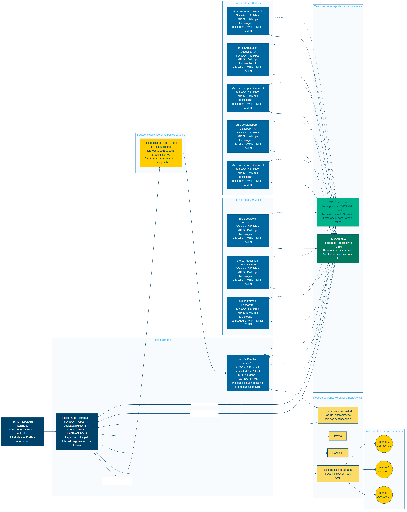

# TERMO DE REFERÊNCIA

**Objeto:** Contratação de serviços continuados de comunicação de dados por MPLS, link dedicado ponto-a-ponto de 25 Gbps entre a Sede e o Foro de Brasília e links dedicados de Internet centralizados na Sede e no Foro, com Anti-DDoS e 32 IPs fixos por link.

**Unidade demandante:** Coordenadoria de Infraestrutura de Tecnologia - CDTEC

**Órgão:** Tribunal Regional do Trabalho da 10ª Região - TRT10

**Processo de referência:** SEI 0009785-67.2025.5.10.8000

**Natureza:** Serviço comum continuado de tecnologia da informação e comunicação, sem dedicação exclusiva de mão de obra.

**Regime de execução:** Empreitada por preço unitário, com medição mensal por circuito, enlace ou link efetivamente ativado, aceito e disponível.

**Critério de julgamento:** Menor preço por grupo ou item, conforme modelagem de parcelamento definida neste Termo de Referência.

**Data:** 13/06/2026

## I - OBJETO

### 1. Definição do objeto

Contratação de empresa ou empresas especializadas para prestar serviços continuados de comunicação de dados e conectividade institucional. O objeto inclui fornecimento, instalação, configuração, ativação, operação, manutenção, monitoramento, suporte técnico, documentação e garantia operacional dos seguintes componentes:

- rede privada corporativa MPLS L3 VPN, ou tecnologia funcionalmente equivalente, para interligação das unidades do TRT10 à Sede, com capacidades equivalentes às capacidades SD-WAN vigentes;
- link dedicado ponto-a-ponto de 25 Gbps entre o Edifício Sede e o Foro de Brasília, por fibra óptica, LAN-to-LAN, Metro Ethernet, clear channel, E-Line, E-LAN ou tecnologia equivalente, sem caracterização como MPLS;
- 3 links dedicados de Internet de 4 Gbps na Sede, com Anti-DDoS e 32 IPs fixos por link;
- 2 links dedicados de Internet de 2 Gbps no Foro de Brasília, com Anti-DDoS e 32 IPs fixos por link.

A solução deve operar integrada à SD-WAN vigente, aos firewalls, roteadores, serviços de segurança, DNS, monitoramento, autenticação, redes internas e demais componentes de TIC indicados pela CDTEC.

### 2. Itens, localidades, capacidades e escopo

| Item | Localidade / enlace | Tecnologia | Quantidade | Capacidade mínima | Disponibilidade mínima | Escopo |
|---:|---|---|---:|---:|---:|---|
| 1 | Edifício Sede | MPLS ou rede privada corporativa equivalente | 1 circuito | 1 Gbps | 99,90% | Concentrador preferencial |
| 2 | Foro de Brasília | MPLS ou rede privada corporativa equivalente | 1 circuito | 1 Gbps | 99,90% | Unidade de alta demanda e ponto redundante |
| 3 | Prédio de Apoio | MPLS ou rede privada corporativa equivalente | 1 circuito | 500 Mbps | 99,90% | Unidade metropolitana |
| 4 | Foro de Taguatinga | MPLS ou rede privada corporativa equivalente | 1 circuito | 500 Mbps | 99,90% | Unidade regional DF |
| 5 | Foro de Palmas | MPLS ou rede privada corporativa equivalente | 1 circuito | 500 Mbps | 99,90% | Polo regional TO |
| 6 | Vara do Gama | MPLS ou rede privada corporativa equivalente | 1 circuito | 100 Mbps | 99,70% | Unidade remota |
| 7 | Foro de Araguaína | MPLS ou rede privada corporativa equivalente | 1 circuito | 100 Mbps | 99,70% | Unidade remota |
| 8 | Vara de Gurupi | MPLS ou rede privada corporativa equivalente | 1 circuito | 100 Mbps | 99,70% | Unidade remota |
| 9 | Vara de Dianópolis | MPLS ou rede privada corporativa equivalente | 1 circuito | 100 Mbps | 99,70% | Unidade remota |
| 10 | Vara de Guaraí | MPLS ou rede privada corporativa equivalente | 1 circuito | 100 Mbps | 99,70% | Unidade remota |
| 11 | Sede ↔ Foro de Brasília | Link dedicado ponto-a-ponto | 1 enlace | 25 Gbps | 99,95% | Replicação, backup, sincronização, redundância da Sede e acesso contingencial |
| 12 | Sede | Internet dedicada com Anti-DDoS e 32 IPs fixos | 1 link | 4 Gbps | 99,90% | Egressão principal, provedor distinto dos itens 13 e 14 |
| 13 | Sede | Internet dedicada com Anti-DDoS e 32 IPs fixos | 1 link | 4 Gbps | 99,90% | Egressão principal, provedor distinto dos itens 12 e 14 |
| 14 | Sede | Internet dedicada com Anti-DDoS e 32 IPs fixos | 1 link | 4 Gbps | 99,90% | Egressão principal, provedor distinto dos itens 12 e 13 |
| 15 | Foro de Brasília | Internet dedicada com Anti-DDoS e 32 IPs fixos | 1 link | 2 Gbps | 99,90% | Egressão redundante, provedor distinto do item 16 |
| 16 | Foro de Brasília | Internet dedicada com Anti-DDoS e 32 IPs fixos | 1 link | 2 Gbps | 99,90% | Egressão redundante, provedor distinto do item 15 |

O edital ou anexo próprio trará os endereços completos das localidades, contatos, salas técnicas, janelas de acesso e condições de instalação.

### 3. Natureza do objeto

O objeto é serviço comum continuado. Seus padrões de desempenho e qualidade podem ser definidos objetivamente por especificações usuais de mercado: capacidade, disponibilidade, latência, perda de pacotes, jitter, prazo de atendimento, prazo de reparo, monitoramento, suporte, relatórios e critérios de aceite.

## II - FUNDAMENTAÇÃO E DESCRIÇÃO DA SOLUÇÃO

### 4. Fundamentação da contratação

A contratação se apoia no Estudo Técnico Preliminar, que definiu a necessidade de continuidade, disponibilidade, segurança, desempenho e governança da conectividade institucional do TRT10. A arquitetura mantém a SD-WAN vigente como camada de transporte e contingência, inclui rede privada MPLS para tráfego crítico, prevê link dedicado de 25 Gbps entre Sede e Foro para replicação e redundância e centraliza os acessos de Internet em Sede e Foro, com Anti-DDoS, 32 IPs fixos e provedores distintos por localidade.

### 5. Descrição da solução como um todo

A arquitetura observará os seguintes papéis técnicos:

- MPLS: caminho privado e controlado para tráfego crítico, sistemas institucionais, autenticação, serviços corporativos, administração, monitoramento e integrações;
- SD-WAN vigente: camada de transporte, convivência operacional e contingência, com uso preferencial para tráfego de Internet das unidades quando aplicável;
- Sede: concentrador principal, ponto preferencial de segurança, observabilidade, integração institucional e egressão principal à Internet;
- Foro de Brasília: ponto redundante de egressão à Internet e ponto contingencial para acesso das unidades em caso de indisponibilidade ou degradação da Sede;
- link dedicado Sede-Foro de 25 Gbps: enlace de alta capacidade para replicação, sincronização, backup, restauração, continuidade, baixa latência e redirecionamento de tráfego entre os pontos centrais;
- links de Internet centrais: enlaces dedicados, simétricos, com Anti-DDoS, 32 IPs fixos por link, provedores distintos por localidade e suporte a roteamento de borda.

## III - REQUISITOS DA CONTRATAÇÃO

### 6. Requisitos técnicos gerais

6.1 A contratada fornecerá todos os meios necessários à prestação do serviço, incluindo circuitos, enlaces, portas, CPEs, roteadores, modems, transceptores, fontes, cabos, licenças, configurações, monitoramento, suporte e manutenção, salvo quando o edital indicar expressamente responsabilidade do TRT10.

6.2 Todos os circuitos, enlaces e links devem ser simétricos, full duplex e entregues com banda útil compatível com a capacidade contratada, ressalvados apenas overheads inerentes aos protocolos de comunicação.

6.3 A solução será especificada e entregue por requisitos funcionais e de desempenho, sem imposição de marca, fabricante, modelo ou solução proprietária específica.

6.4 A contratada manterá sigilo sobre informações de rede, endereçamento, rotas, configurações, chamados, incidentes, topologia e dados técnicos do TRT10.

### 7. Requisitos específicos da rede MPLS

7.1 A rede MPLS, ou tecnologia privada equivalente, proverá isolamento lógico do tráfego do TRT10 por VRF ou mecanismo equivalente.

7.2 A rede suportará QoS fim a fim, com no mínimo as seguintes classes:

- tráfego crítico de sistemas judiciais, autenticação, serviços internos e administração;
- voz, vídeo e colaboração institucional;
- tráfego corporativo administrativo;
- monitoramento, gerenciamento e backup operacional;
- melhor esforço.

7.3 As marcações e reservas mínimas de QoS ficam definidas da seguinte forma: classe crítica com DSCP AF31/CS3 ou equivalente e reserva mínima de 35% da banda; voz/vídeo com DSCP EF/AF41 ou equivalente e reserva mínima de 20%; tráfego corporativo administrativo com DSCP AF21 ou equivalente e reserva mínima de 25%; monitoramento, gerenciamento e backup operacional com reserva mínima de 5%; melhor esforço com uso da banda remanescente. As filas poderão aproveitar banda ociosa entre classes.

7.4 A rede permitirá integração com a infraestrutura existente do TRT10. OSPF fica definido como protocolo preferencial de integração interna; BGP será usado para bordas, ASN, operadoras, Internet ou cenários definidos pela CDTEC.

7.5 A contratada implementará filtros, métricas, anúncios autorizados e mecanismos de prevenção de rotas indevidas ou loops, conforme desenho aprovado pela fiscalização técnica.

### 8. Requisitos específicos do link dedicado Sede-Foro de 25 Gbps

8.1 O enlace Sede-Foro deve ser dedicado, ponto-a-ponto, simétrico, full duplex, por fibra óptica, LAN-to-LAN, Metro Ethernet, clear channel, E-Line, E-LAN ou tecnologia equivalente.

8.2 O TRT10 não aceitará o enlace como circuito MPLS compartilhado de filial. Sua finalidade é criar conexão privativa de alta capacidade entre dois pontos centrais do Tribunal.

8.3 O enlace suportará tráfego de replicação, sincronização, backup, restauração, comunicação entre ambientes centrais, testes de continuidade e redirecionamento contingencial de acesso das unidades ao Foro.

8.4 O aceite comprovará capacidade de 25 Gbps, latência, perda, identificação de interfaces, caminho lógico, documentação dos equipamentos envolvidos, testes de tráfego e integração com as rotas definidas pela CDTEC.

### 9. Requisitos específicos dos links de Internet

9.1 Cada link de Internet deve ser dedicado, simétrico, por fibra óptica, com banda mínima contratada de 4 Gbps na Sede e 2 Gbps no Foro de Brasília, conforme tabela de itens.

9.2 Cada link incluirá 32 IPs fixos públicos, equivalentes a bloco IPv4 /27 ou arranjo funcional aceito pela CDTEC, sem compartilhamento com terceiros.

9.3 Cada link incluirá proteção Anti-DDoS, com detecção, mitigação, acionamento 24x7, relatório de eventos, indicação de tráfego atacado e retorno do tráfego limpo quando aplicável.

9.4 Fornecedores distintos proverão os links de Internet da mesma localidade. A mesma empresa, CNPJ, grupo econômico ou provedor operacionalmente dependente não poderá vencer mais de um link de Internet na Sede nem mais de um link de Internet no Foro. A mesma empresa poderá vencer um link da Sede e um link do Foro.

9.5 Os links suportarão roteamento de borda, inclusive BGP quando adotado pelo TRT10, DNS reverso quando aplicável, monitoramento, coleta de disponibilidade, latência, perda, jitter, utilização média e utilização de pico.

### 10. Sustentabilidade e acessibilidade

A contratada observará eficiência energética compatível com o mercado, descarte ambientalmente adequado de equipamentos, cabos, fontes e embalagens, redução de deslocamentos por monitoramento remoto, documentação digital, reaproveitamento de infraestrutura existente quando autorizado e preservação da acessibilidade física em salas técnicas, racks, shafts e áreas de circulação.

## IV - MODELO DE EXECUÇÃO

### 11. Início da execução e plano de implantação

11.1 A execução terá início após assinatura do contrato e emissão da ordem de serviço.

11.2 A contratada apresentará plano de implantação em até 10 dias corridos da emissão da ordem de serviço, com cronograma, responsáveis, pré-requisitos, janelas de mudança, riscos, plano de rollback, contatos de NOC, matriz de responsabilidades e plano de testes.

11.3 O prazo máximo de implantação é de 120 dias corridos, contados da ordem de serviço. O prazo abrange Sede, Foro, link dedicado Sede-Foro, links de Internet centrais, circuitos MPLS, testes integrados e documentação as built.

### 12. Fases mínimas de implantação

| Fase | Escopo | Resultado esperado |
|---:|---|---|
| 1 | Sede | Ativação de concentrador MPLS, links de Internet, integração de borda, monitoramento e testes iniciais |
| 2 | Foro de Brasília | Ativação de MPLS, links de Internet, preparação de egressão redundante e integração com Sede |
| 3 | Link dedicado Sede-Foro | Ativação do enlace de 25 Gbps, testes de tráfego, replicação, rotas e contingência |
| 4 | Prédio de Apoio, Taguatinga e Palmas | Ativação dos circuitos MPLS de 500 Mbps |
| 5 | Gama, Araguaína, Gurupi, Dianópolis e Guaraí | Ativação dos circuitos MPLS de 100 Mbps |
| 6 | Operação assistida | Validação de SLA, QoS, Anti-DDoS, failover, relatórios, documentação e recebimento definitivo |

### 13. Testes de aceite

13.1 O aceite provisório de cada circuito, enlace ou link depende dos testes mínimos de ativação.

13.2 Para MPLS, os testes devem comprovar identificação do circuito, capacidade contratada, conectividade com a Sede, roteamento, QoS, monitoramento, latência, perda, disponibilidade do CPE, abertura de chamado teste e documentação as built.

13.3 Para o link dedicado Sede-Foro de 25 Gbps, os testes devem comprovar capacidade, latência, perda, estabilidade, interfaces, rota lógica, conectividade entre ambientes centrais, testes de replicação ou tráfego equivalente e acionamento contingencial do Foro.

13.4 Para links de Internet, os testes devem comprovar capacidade, entrega dos 32 IPs fixos, roteamento, BGP quando aplicável, DNS reverso quando aplicável, Anti-DDoS por simulação controlada ou evidência técnica aceita, latência, perda, jitter, monitoramento e independência de provedor na mesma localidade.

13.5 O aceite definitivo ocorrerá após operação assistida mínima de 30 dias, saneamento das pendências críticas e entrega da documentação final.

## V - MODELO DE GESTÃO CONTRATUAL

### 14. Fiscalização

Servidores formalmente designados exercerão a gestão e a fiscalização. A fiscalização técnica validará disponibilidade, desempenho, relatórios, chamados, incidentes, mudanças, testes, aceite, glosas e documentação.

### 15. Relatório mensal

A contratada entregará relatório mensal até o 5º dia útil do mês subsequente, contendo:

- disponibilidade por circuito, enlace e link;
- indisponibilidades programadas e não programadas;
- chamados abertos, severidade, causa raiz, horário de abertura, início de atendimento e normalização;
- latência, perda de pacotes, jitter, utilização média e utilização de pico;
- eventos de failover, contingência e degradação;
- eventos de Anti-DDoS, quando houver;
- manutenções programadas;
- cálculo de glosas ou justificativa de inexistência de glosa;
- pendências, recomendações operacionais e mudanças realizadas.

### 16. Níveis mínimos de serviço

| Indicador | Meta | Forma de aferição |
|---|---:|---|
| Disponibilidade Sede, Foro, Prédio de Apoio, Taguatinga e Palmas | 99,90% mensal | Relatório da contratada, monitoramento e validação do TRT10 |
| Disponibilidade Gama, Araguaína, Gurupi, Dianópolis e Guaraí | 99,70% mensal | Relatório da contratada, monitoramento e validação do TRT10 |
| Disponibilidade do link dedicado Sede-Foro 25 Gbps | 99,95% mensal | Relatório da contratada, monitoramento e validação do TRT10 |
| Disponibilidade dos links de Internet | 99,90% mensal por link | Relatório da contratada, monitoramento e validação do TRT10 |
| Início de atendimento para indisponibilidade total | até 30 minutos | Registro de chamado |
| Início de atendimento para degradação severa | até 1 hora | Registro de chamado |
| Início de atendimento para chamado ordinário | até 4 horas úteis | Registro de chamado |
| Reparo para Sede, Foro e link Sede-Foro | até 4 horas | Registro de chamado |
| Reparo para demais localidades do DF | até 6 horas | Registro de chamado |
| Reparo para localidades do Tocantins | até 8 horas | Registro de chamado |
| Perda média de pacotes | inferior a 1% | Medições automáticas e relatório |
| Jitter médio para tráfego sensível | inferior a 30 ms | Medições automáticas e relatório |
| Latência média até a Sede no DF | inferior a 30 ms | Medições automáticas e relatório |
| Latência média até a Sede no Tocantins | inferior a 80 ms | Medições automáticas e relatório |

### 17. Fórmula de disponibilidade

A disponibilidade mensal será calculada pela fórmula:

`D = ((Tt - Ti) / Tt) x 100`

em que `D` é a disponibilidade mensal, `Tt` é o tempo total mensal em minutos e `Ti` é o tempo de indisponibilidade imputável à contratada.

Falhas causadas por equipamentos, enlaces, backbone, CPEs, configurações, portas, enlaces de acesso, Anti-DDoS, roteamento ou outros elementos sob responsabilidade da contratada contam como indisponibilidade ou degradação imputável à contratada.

### 18. Glosas por descumprimento de SLA

As glosas incidem sobre a mensalidade do circuito, enlace ou link afetado, sem prejuízo de sanções:

| Situação | Glosa |
|---|---:|
| Disponibilidade abaixo da meta e até 0,5 ponto percentual abaixo dela | 5% da mensalidade do item afetado |
| Disponibilidade mais de 0,5 e até 1 ponto percentual abaixo da meta | 10% da mensalidade do item afetado |
| Disponibilidade mais de 1 ponto percentual abaixo da meta | 20% da mensalidade do item afetado |
| Indisponibilidade superior a 24 horas acumuladas no mês | 30% da mensalidade do item afetado |
| Ausência de relatório mensal no prazo | 2% da mensalidade total do grupo ou item correspondente |
| Não entrega de documentação as built após aceite | 5% da mensalidade do item afetado até regularização |
| Descumprimento de prazo de início de atendimento ou reparo | 2% a 10% da mensalidade do item afetado, conforme gravidade e recorrência |

## VI - OBRIGAÇÕES

### 19. Obrigações da contratada

A contratada deve:

- prestar os serviços conforme especificações, capacidades, SLA e prazos;
- fornecer, instalar, configurar, ativar, operar, manter e substituir equipamentos sob sua responsabilidade;
- monitorar os circuitos, enlaces, links e equipamentos 24x7;
- manter central de atendimento com portal, telefone e e-mail;
- registrar, acompanhar, escalar e encerrar chamados;
- comunicar incidentes críticos e manutenções programadas;
- manter sigilo sobre informações técnicas e operacionais;
- entregar plano de implantação, documentação técnica, documentação as built e relatórios mensais;
- preservar a continuidade dos serviços durante manutenções e mudanças;
- apoiar testes de contingência, Anti-DDoS, failover, QoS e roteamento;
- responder integralmente pela execução, inclusive quando houver subcontratação acessória;
- manter autorização, outorga, licença ou regularidade regulatória aplicável à prestação dos serviços.

### 20. Obrigações do contratante

O TRT10 deve:

- disponibilizar acesso às dependências, salas técnicas, racks e pontos de instalação;
- indicar fiscais, gestor e pontos de contato técnico;
- aprovar janelas de manutenção com risco de impacto;
- fornecer informações necessárias de endereçamento, rotas, políticas de segurança e integração;
- realizar testes de aceite e fiscalização;
- registrar chamados e evidências de indisponibilidade quando detectadas;
- efetuar pagamentos após aceite, medição e validação da prestação dos serviços.

## VII - CRITÉRIOS DE SELEÇÃO DO FORNECEDOR

### 21. Habilitação jurídica, fiscal, social e trabalhista

Aplicam-se os requisitos ordinários da Lei nº 14.133/2021, do edital e da regulamentação aplicável.

### 22. Regularidade regulatória

A licitante deve comprovar autorização, outorga, licença ou regularidade regulatória aplicável à prestação de serviços de telecomunicações/comunicação de dados, especialmente SCM ou enquadramento equivalente perante a Anatel, diretamente ou por arranjo juridicamente admitido.

### 23. Qualificação técnica

A licitante deve comprovar experiência anterior compatível com o grupo ou item disputado:

- para o grupo MPLS: prestação de serviço de rede corporativa MPLS, L3VPN, rede privada gerenciada ou tecnologia equivalente, com múltiplas localidades, monitoramento, suporte, SLA, CPEs ou roteadores e operação continuada;
- para o item/link dedicado Sede-Foro: prestação de serviço de link dedicado, LAN-to-LAN, Metro Ethernet, E-Line, E-LAN, clear channel ou enlace privativo de alta capacidade por fibra óptica;
- para os links de Internet: prestação de serviço de Internet dedicada corporativa com capacidade elevada, suporte, SLA, roteamento e proteção Anti-DDoS ou serviço equivalente.

Para o grupo MPLS, a experiência mínima deve abranger pelo menos 5 localidades ou 50% do quantitativo de localidades do TRT10, admitido somatório de atestados tecnicamente compatíveis. Para enlaces de alta capacidade, aceita-se comprovação de experiência com pelo menos 1 enlace de 1 Gbps ou superior, sem exigir identidade absoluta com a capacidade de 25 Gbps.

Não se exigirá certificação de fabricante específico. O edital poderá exigir indicação de responsável técnico ou equipe técnica com experiência em redes corporativas, telecomunicações, roteamento, segurança de rede ou operação de serviços de comunicação de dados.

### 24. Qualificação econômico-financeira

Exigem-se as qualificações econômico-financeiras ordinárias previstas na legislação e no edital, incluindo balanço patrimonial e demonstrações contábeis quando aplicáveis. Caso os índices contábeis mínimos não sejam atendidos, admite-se comprovação alternativa de patrimônio líquido mínimo de 10% do valor estimado anual do grupo ou item disputado, observada a proporcionalidade e os limites legais.

### 25. Vistoria

A vistoria é facultativa e poderá ser substituída por declaração de conhecimento das condições locais e responsabilidade pela proposta. A ausência de vistoria não justificará acréscimo posterior de custos, desde que o edital disponibilize as informações mínimas de localidade, endereço e condições de execução.

## VIII - PARCELAMENTO, ADJUDICAÇÃO E DIVERSIDADE DE PROVEDORES

### 26. Modelagem de parcelamento

A contratação fica parcelada da seguinte forma:

- Grupo 1: circuitos MPLS dos itens 1 a 10, em razão da necessidade de roteamento integrado, QoS, monitoramento centralizado, SLA de ponta a ponta e responsabilização técnica única;
- Item 11: link dedicado ponto-a-ponto Sede-Foro de 25 Gbps, em item próprio, por possuir tecnologia, finalidade e escala distintas da malha MPLS;
- Itens 12, 13 e 14: links de Internet da Sede, licitados separadamente;
- Itens 15 e 16: links de Internet do Foro de Brasília, licitados separadamente.

### 27. Regra de diversidade para links de Internet

Uma mesma empresa, CNPJ, grupo econômico ou provedor operacionalmente dependente não poderá ser adjudicatário de mais de um link de Internet na mesma localidade. Se a mesma licitante apresentar a melhor proposta em mais de um item de Internet da mesma localidade, receberá apenas um desses itens, observada a ordem de vantajosidade definida no edital. Para os demais itens, a Administração convocará a próxima classificada aceitável.

## IX - VIGÊNCIA, PAGAMENTO, REAJUSTE E GARANTIA

### 28. Vigência

A vigência inicial é de 60 meses. Trata-se de serviço continuado essencial, com prestação ininterrupta, implantação relevante, necessidade de amortização de infraestrutura, monitoramento permanente e maior vantajosidade esperada em contratos de prazo compatível com telecomunicações corporativas.

### 29. Pagamento

O pagamento é mensal, por circuito, enlace ou link efetivamente ativado, aceito e disponível. A liberação depende de nota fiscal, relatório mensal, validação de disponibilidade, aplicação de glosas quando cabíveis e ateste da fiscalização.

Não haverá pagamento por circuito, enlace ou link antes do respectivo aceite provisório.

### 30. Reajuste

O reajuste observará periodicidade mínima legal de 12 meses, contados da data do orçamento estimado. Aplica-se índice setorial próprio de serviços de telecomunicações ou, na ausência de definição setorial adotada pelo TRT10, IPCA/IBGE.

### 31. Garantia de execução contratual

Exige-se garantia de execução contratual de 5% do valor anual estimado do grupo ou item contratado, nas modalidades previstas na Lei nº 14.133/2021. A garantia deve permanecer válida durante toda a vigência contratual e por 90 dias após seu encerramento, cobrindo atraso de implantação, descumprimento de SLA, indisponibilidade, falhas de integração, danos, multas e obrigações inadimplidas.

## X - ESTIMATIVA DE VALOR

### 32. Valor estimado da contratação

A estimativa de planejamento, baseada em referências PNCP documentadas no ETP, é de **R$ 154.654,55 mensais** e **R$ 1.855.854,60 anuais**, conforme memória de cálculo:

| Grupo / item | Referências e fórmula | Quantidade | Valor mensal unitário | Valor mensal | Valor anual |
|---|---|---:|---:|---:|---:|
| MPLS 1 Gbps | Mediana PNCP: SENAR/MS R$ 6.950,00; Brusque/SC R$ 7.295,00; Chapecó/SC R$ 574,00; ANCINE R$ 8.211,77 | 2 | R$ 7.122,50 | R$ 14.245,00 | R$ 170.940,00 |
| MPLS 500 Mbps | Mediana PNCP: Chapecó/SC R$ 410,00; ANCINE R$ 5.875,42; Cascavel/PR R$ 1.900,00 | 3 | R$ 1.900,00 | R$ 5.700,00 | R$ 68.400,00 |
| MPLS 100 Mbps | Mediana PNCP: CODEVASF R$ 2.161,00; Cascavel/PR R$ 1.900,00; Chapecó/SC R$ 202,97 | 5 | R$ 1.900,00 | R$ 9.500,00 | R$ 114.000,00 |
| Link dedicado Sede-Foro 25 Gbps | Ponto médio da faixa paramétrica: (R$ 30.000,00 + R$ 60.000,00) / 2 | 1 | R$ 45.000,00 | R$ 45.000,00 | R$ 540.000,00 |
| Internet Sede 4 Gbps com Anti-DDoS e 32 IPs fixos | Ipojuca/PE 4 Gbps com Anti-DDoS R$ 15.687,33 + Chapecó/SC IP /27 R$ 1.920,00 | 3 | R$ 17.607,33 | R$ 52.821,99 | R$ 633.863,88 |
| Internet Foro 2 Gbps com Anti-DDoS e 32 IPs fixos | Mediana conservadora: IPEA R$ 5.520,00; Ministério da Defesa + /27 R$ 13.693,78; CLDF R$ 23.520,00 | 2 | R$ 13.693,78 | R$ 27.387,56 | R$ 328.650,72 |
| **Total estimado** | Soma dos grupos e itens | 16 itens | - | **R$ 154.654,55** | **R$ 1.855.854,60** |

### 33. Referências PNCP utilizadas

| Órgão | Certame / processo / PNCP | Uso na estimativa |
|---|---|---|
| SENAR/MS | Pregão Eletrônico nº 009/2026; Processo nº 018/2026; PNCP nº 04253881000103-1-000025/2026 | MPLS 1 Gbps |
| Município de Brusque/SC | Pregão Eletrônico nº 11/2026; Processo nº 33/2026; PNCP nº 83102343000194-1-000064/2026 | MPLS 1 Gbps |
| Município de Chapecó/SC | Pregão Eletrônico nº 153/2026; Processo nº 153/2026; PNCP nº 83021808000182-1-000200/2026 | MPLS, Internet de alta capacidade e IP /27 |
| ANCINE | Pregão Eletrônico nº 90007/2025; Processo nº 01416.005548/2024-11; PNCP nº 04884574000120-1-000056/2025 | MPLS/SD-WAN e Anti-DDoS |
| Município de Cascavel/PR | Pregão Eletrônico nº 90129/2025; Processo nº 115968; PNCP nº 76208867000107-1-000429/2025 | MPLS 100 Mbps e 500 Mbps |
| CODEVASF | Pregão Eletrônico nº 90003/2025; Processo nº 59500002693202462; PNCP nº 00399857000126-1-000049/2025 | MPLS, SLA, CPE e suporte |
| Município de Ipojuca/PE | Pregão Eletrônico nº 035/PMI-SMAD/2024; Processo nº 188/PMI-SMAD/2024; PNCP nº 11294386000108-1-000244/2024 | Internet 4 Gbps com Anti-DDoS |
| Câmara Legislativa do Distrito Federal | Aviso de Contratação Direta nº 90021/2025; PNCP nº 26963645000113-1-000038/2025 | Internet 2 Gbps com Anti-DDoS |
| IPEA | Pregão Eletrônico nº 90047/2026; PNCP nº 33892175000100-1-000033/2026 | Internet 2 Gbps com Anti-DDoS |
| Ministério da Defesa | Dispensa com Disputa nº 292/2025; Processo nº 60591.000013/2025-64; PNCP nº 03277610000125-1-000586/2025 | Internet 1 Gbps e Anti-DDoS, composição paramétrica |
| Município de Candeias/BA | Edital nº 023/2026; PNCP nº 13830336000123-1-000051/2026 | Referência técnica para LAN-to-LAN e link dedicado |
| Município de Ubarana/SP | Edital nº 19/2026; PNCP nº 65708786000141-1-000038/2026 | Referência técnica para LAN-to-LAN e link dedicado |
| Município de Jaguariúna/SP | Pregão Eletrônico nº 90081/2024; PNCP nº 46410866000171-1-000610/2024 | Referência técnica para link dedicado de alta capacidade |
| Justiça Federal do Rio Grande do Sul / TRF4 | Pregão Eletrônico nº 90012/2025; Ata de Registro de Preços nº 10/2025; PNCP relacionado a 00508903000188-1-002018/2025 | Referência técnica para Metro Ethernet/LAN-to-LAN ponto-a-ponto |

## XI - SANÇÕES, ALTERAÇÃO E EXTINÇÃO

### 34. Sanções

Aplicam-se as sanções previstas na Lei nº 14.133/2021, no edital e no contrato, sem prejuízo das glosas de nível de serviço previstas neste Termo de Referência.

### 35. Alteração contratual

Alterações de capacidade, localidades, rotas, endereçamento, links ou requisitos exigem justificativa técnica, disponibilidade orçamentária, respeito aos limites legais, manutenção da vantajosidade e formalização por instrumento próprio.

### 36. Extinção contratual

A extinção contratual seguirá as hipóteses legais, contratuais e editalícias, especialmente inadimplemento, descumprimento reiterado de SLA, falha grave de segurança, interrupção injustificada dos serviços, perda de regularidade regulatória ou impossibilidade de continuidade operacional.

## XII - SUBCONTRATAÇÃO

### 37. Regras de subcontratação

Admite-se subcontratação apenas para atividades acessórias, como infraestrutura local, lançamento de fibra, passagem de cabos, adequações físicas leves, vistorias, instalação de último trecho e atendimento de campo.

Não se admite subcontratação que transfira a responsabilidade principal pela rede privada corporativa, pelo link dedicado Sede-Foro, pelos links de Internet, pela proteção Anti-DDoS, pela gerência dos circuitos, pelo cumprimento de SLA, pelo suporte ao TRT10, pela segurança das informações ou pela documentação da solução.

## XIII - ANEXOS

Integram este Termo de Referência:

| Anexo | Título | Finalidade |
|---|---|---|
| I | Arquitetura técnica da solução | Descrever arquitetura MPLS, SD-WAN, link dedicado Sede-Foro e Internet centralizada |
| II | Localidades, capacidades e itens | Consolidar localidades, capacidades, tecnologias e escopo por item |
| III | Requisitos técnicos detalhados | Detalhar rede privada, Internet, Anti-DDoS, roteamento, QoS, segurança e equipamentos |
| IV | Implantação, migração e rollback | Definir fases, prazos, janelas e retorno |
| V | Plano de testes e aceite | Estabelecer testes mínimos e critérios de recebimento |
| VI | Níveis de serviço, medição e glosas | Detalhar indicadores, fórmulas e descontos |
| VII | Matriz de riscos | Consolidar riscos, causas, impactos, mitigação e responsáveis |
| VIII | Modelo de relatório mensal | Padronizar informações de disponibilidade, desempenho, incidentes e contingência |
| IX | Pesquisa de preços e referências PNCP | Registrar fontes, fórmulas e metodologia da estimativa |

## XIV - RESPONSÁVEL

**Unidade:** Coordenadoria de Infraestrutura de Tecnologia - CDTEC

**Servidor responsável:** Edson Mateus de Sousa

**E-mail:** cdtec@trt10.jus.br

**Telefone:** (61) 3348-1249 / 1288 / 1280 / 1188
