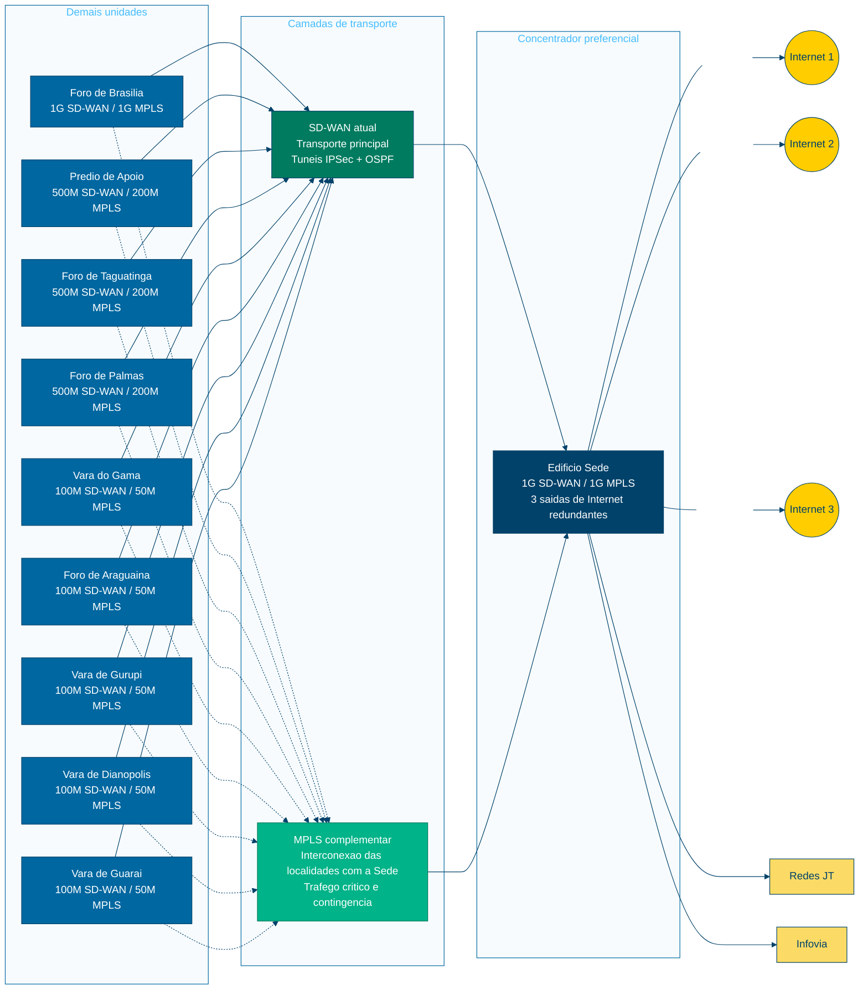

# Documento de Formalizacao de Demanda (DFD) - Versao Revisada

**Orgao:** Tribunal Regional do Trabalho da 10a Regiao - TRT10  
**Unidade demandante:** Coordenadoria de Infraestrutura de Tecnologia - CDTEC  
**Processo de referencia:** SEI 0009785-67.2025.5.10.8000  
**Data da revisao:** 21/05/2026  
**Objeto revisado:** manutencao da topologia SD-WAN atual e contratacao complementar de links MPLS de menor capacidade para todas as localidades, com interconexao das demais localidades a Sede por MPLS e saida de Internet preferencialmente centralizada na Sede, sustentada por 3 saidas de Internet redundantes.

## 1. Unidade Demandante

### 1.1 Nome da unidade

Coordenadoria de Infraestrutura de Tecnologia.

### 1.2 Sigla da unidade

CDTEC.

## 2. Justificativa da Necessidade da Contratacao

### 2.1 Justificativa da necessidade

O Tribunal Regional do Trabalho da 10a Regiao, no desempenho de suas atividades jurisdicionais e administrativas, necessita assegurar conectividade permanente, segura e resiliente entre suas unidades, bem como acesso adequado a Internet, as redes JT, a Infovia e aos demais servicos corporativos essenciais.

A infraestrutura de comunicacao de dados sustenta o acesso ao processo judicial eletronico, sistemas administrativos, servicos internos de TIC, ferramentas colaborativas, autenticacao externa, comunicacao institucional, rotinas de suporte, contingencia, replicacao de dados e recuperacao de desastres. Assim, a continuidade operacional do TRT10 depende de arquitetura de rede capaz de combinar disponibilidade, desempenho, seguranca, controle centralizado e capacidade de evolucao.

Atualmente, o TRT10 possui topologia SD-WAN implantada nas localidades institucionais, baseada em enlaces de dados dedicados, tuneis IPSec, roteamento dinamico OSPF e concentracao em pontos centrais. Conforme o projeto executivo de SD-WAN do Pregao Eletronico no 033/2023, a arquitetura contempla 10 localidades, com enlaces atuais de 1 Gbps para a Sede e o Foro de Brasilia, 500 Mbps para Predio de Apoio, Foro de Taguatinga e Foro de Palmas, e 100 Mbps para Vara do Gama, Foro de Araguaina, Vara de Gurupi, Vara de Dianopolis e Vara de Guarai.

A revisao da demanda propoe manter os links SD-WAN atuais como transporte principal, preservando o investimento ja realizado, a capilaridade existente, a redundancia logica por tuneis e a capacidade ja disponivel nas unidades. Em complemento, propoe-se contratar links MPLS de menor capacidade para todas as localidades, de forma que todas as unidades, exceto a propria Sede, sejam interconectadas a Sede por MPLS para trafego corporativo critico, contingencia controlada, isolamento de servicos sensiveis e melhoria da previsibilidade de comunicacao entre unidades.

Essa abordagem reduz a necessidade de substituicao integral da arquitetura existente e evita a contratacao duplicada de links de Internet dedicados de alta capacidade em todas as unidades. A saida principal de Internet das localidades devera ser preferencialmente centralizada na Sede, que funcionara como ponto concentrador principal, com 3 saidas de Internet redundantes, capacidade ampliada, politicas padronizadas de seguranca, inspecao de trafego, monitoramento e controle centralizado.

Caso a contratacao nao seja realizada, o Tribunal permanecera dependente de uma arquitetura com menor segregacao entre trafego critico, trafego corporativo e acesso a Internet, alem de manter maior complexidade para padronizacao de politicas de seguranca, priorizacao e contingencia. Tambem permanecera maior risco de indisponibilidade ou degradacao em caso de falhas nos enlaces atuais, com impacto potencial sobre sistemas judiciais, sistemas administrativos, atendimento ao publico, suporte tecnico e rotinas de continuidade.

Dessa forma, a necessidade administrativa nao se resume a contratacao de links como item tecnico isolado, mas a consolidacao de uma arquitetura hibrida, composta por SD-WAN existente e MPLS complementar, apta a garantir continuidade, disponibilidade, seguranca, desempenho e governanca da comunicacao de dados institucional.

### 2.2 A necessidade de contratacao decorre de exigencia legal?

Embora nao exista exigencia legal especifica para a contratacao deste objeto em particular, a demanda guarda relacao direta com as diretrizes de governanca de TIC aplicaveis ao Poder Judiciario, especialmente com a Estrategia Nacional de Tecnologia da Informacao e Comunicacao do Poder Judiciario - ENTIC-JUD 2021-2026.

O Guia da ENTIC-JUD 2021-2026 estabelece que as areas de TIC dos tribunais devem prover links de comunicacao entre as unidades e o orgao, suficientes para suportar o trafego de dados e garantir a disponibilidade exigida pelos sistemas de informacao, especialmente o processo judicial. Tambem recomenda links de comunicacao do orgao com a Internet, preferencialmente com operadoras distintas, para acesso a rede de dados.

A presente demanda, portanto, decorre da necessidade administrativa de assegurar continuidade, disponibilidade, seguranca e desempenho a comunicacao de dados institucional, em aderencia as diretrizes de TIC do Poder Judiciario e ao planejamento tecnico do TRT10.

### 2.3 Unidades beneficiadas

Serao beneficiados a sociedade, o jurisdicionado, magistrados, servidores, colaboradores, usuarios externos e todas as unidades do TRT10 atendidas pela arquitetura de conectividade. A demanda contempla as seguintes localidades:

| Item | Unidade / Localidade | Endereco | Municipio | UF | CEP |
|---:|---|---|---|---|---|
| 1 | Edificio Sede | SAS Quadra 1, Bloco D, Praca dos Tribunais Superiores | Brasilia | DF | 70.097-900 |
| 2 | Foro de Brasilia | SEPN 513, Bloco B, Lotes 2/3 | Brasilia | DF | 70.760-522 |
| 3 | Foro de Taguatinga | Quadra C12, Bloco O, Lotes 1 a 5 e 8 a 12 | Taguatinga | DF | 72.010-120 |
| 4 | Vara do Gama | Area Especial 01, Praca 02, Lote 06 | Gama | DF | 72.405-610 |
| 5 | Foro de Araguaina | Av. Neief Murad, 1131, Jardim Goias | Araguaina | TO | 77.824-022 |
| 6 | Foro de Palmas | Quadra 302 Norte, Conjunto QI 12, Alameda 2, Lote IA | Palmas | TO | 77.066-338 |
| 7 | Vara de Gurupi | Rua Antonio Lisboa da Cruz, 2031, Centro, Setor Central | Gurupi | TO | 77.405-100 |
| 8 | Vara de Dianopolis | Avenida Wolney Filho, Qd. 69 A, Setor Novo Horizonte | Dianopolis | TO | 77.300-000 |
| 9 | Vara de Guarai | Avenida Araguaia, esquina com Av. Bernardo Sayao, 1360 | Guarai | TO | 77.700-000 |
| 10 | Predio de Apoio | SGAN 916 Norte, Lote AI, Asa Norte | Brasilia | DF | 70.790-160 |

### 2.4 Consequencias do nao atendimento da demanda

- Manutencao de maior dependencia da SD-WAN como unico transporte estruturado entre as unidades.
- Menor previsibilidade para trafego corporativo critico em cenarios de degradacao de enlaces de Internet.
- Dificuldade de padronizar politicas de seguranca, inspecao de trafego, logs e controle de acesso a Internet.
- Maior risco de indisponibilidade ou lentidao no acesso a sistemas judiciais, administrativos e colaborativos.
- Menor capacidade de contingencia para acesso a redes JT, Infovia e servicos institucionais.
- Dificuldade de evoluir para arquitetura com saida de Internet centralizada na Sede e interconexao MPLS das demais localidades.
- Comprometimento de rotinas de backup, replicacao, contingencia e recuperacao de desastres em caso de falhas simultaneas ou degradacao dos enlaces principais.
- Risco de descumprimento de diretrizes de governanca de TIC relativas a disponibilidade, redundancia e capacidade adequada de comunicacao.
- Reducao da qualidade dos servicos prestados ao jurisdicionado e a sociedade.

## 3. Objeto da Contratacao

### 3.1 Objeto

Contratacao de servicos continuados de comunicacao de dados por meio de links MPLS de menor capacidade para todas as localidades do TRT10, em complemento aos links SD-WAN atualmente existentes, incluindo fornecimento, instalacao, configuracao, operacao assistida, monitoramento, suporte, garantia de niveis de servico e os equipamentos necessarios a prestacao do servico.

A contratacao devera possibilitar:

- manutencao dos enlaces SD-WAN atuais como transporte principal das unidades;
- implantacao de camada MPLS complementar para trafego corporativo critico, contingencia e isolamento logico;
- saida de Internet preferencialmente centralizada na Sede, com 3 saidas redundantes;
- interconexao de todas as demais localidades a Sede por MPLS;
- capacidade agregada suficiente, na Sede, para suportar a saida de Internet das unidades;
- integracao com as redes JT, Infovia e demais redes institucionais;
- roteamento dinamico, preferencialmente com OSPF ou BGP, conforme desenho final aprovado no projeto executivo;
- aplicacao de QoS para priorizacao de trafego critico;
- criptografia, segmentacao e politicas de seguranca compatíveis com as normas institucionais de TIC e protecao de dados.

## 4. Quantidade a Ser Contratada

### 4.1 Premissas de dimensionamento

As capacidades MPLS abaixo sao referenciais para subsidiar o Estudo Tecnico Preliminar e a pesquisa de precos. O dimensionamento definitivo devera ser validado por meio de medicoes de utilizacao real da SD-WAN, volumetria de usuarios, criticidade dos servicos, politica de QoS e modelo operacional da Sede como concentrador preferencial.

Como premissa conservadora, a soma da capacidade SD-WAN atual das localidades e de aproximadamente 4 Gbps, considerando os enlaces informados no projeto executivo. Para que a Sede possa agregar a saida de Internet de todos, recomenda-se que possua 3 links de Internet redundantes, com capacidade minima combinada de 4 Gbps em operacao normal, preferencialmente com operadoras e rotas fisicas distintas. Para resiliencia, deve-se prever capacidade de contingencia e politica de degradacao controlada para manter os servicos essenciais em caso de falha parcial de uma ou mais saidas centrais.

### 4.2 Estimativa de quantidades e capacidades

| Item | Localidade | SD-WAN atual conforme projeto | Link MPLS complementar proposto | Papel na arquitetura |
|---:|---|---:|---:|---|
| 1 | Edificio Sede | 1 Gbps | 1 Gbps | Concentrador principal, 3 saidas redundantes de Internet, redes JT/Infovia, seguranca centralizada |
| 2 | Foro de Brasilia | 1 Gbps | 1 Gbps | Localidade interconectada a Sede por MPLS, com papel complementar de contingencia conforme projeto executivo |
| 3 | Predio de Apoio | 500 Mbps | 200 Mbps | Unidade metropolitana com acesso corporativo redundante |
| 4 | Foro de Taguatinga | 500 Mbps | 200 Mbps | Unidade regional DF com demanda intermediaria |
| 5 | Foro de Palmas | 500 Mbps | 200 Mbps | Polo TO com demanda intermediaria |
| 6 | Vara do Gama | 100 Mbps | 50 Mbps | Unidade remota com trafego critico protegido |
| 7 | Foro de Araguaina | 100 Mbps | 50 Mbps | Unidade remota com trafego critico protegido |
| 8 | Vara de Gurupi | 100 Mbps | 50 Mbps | Unidade remota com trafego critico protegido |
| 9 | Vara de Dianopolis | 100 Mbps | 50 Mbps | Unidade remota com trafego critico protegido |
| 10 | Vara de Guarai | 100 Mbps | 50 Mbps | Unidade remota com trafego critico protegido |

### 4.3 Itens complementares a prever

- 3 links de Internet centralizados e redundantes na Sede, preferencialmente com operadoras e rotas fisicas distintas.
- Equipamentos de borda, roteadores, CPEs ou integracao com firewalls existentes, sem vinculacao a marca especifica.
- Servicos de implantacao, configuracao, testes de aceite, documentacao e transferencia de conhecimento.
- Monitoramento 24x7 dos links, alertas de indisponibilidade e relatorios mensais de SLA.
- Suporte tecnico com prazos definidos para falha critica, degradacao e indisponibilidade.
- Enderecamento, roteamento, QoS, segmentacao e politicas de seguranca documentadas no projeto executivo.

## 5. Estimativa Preliminar do Valor da Contratacao

O valor estimado devera ser apurado em pesquisa de precos formal, observando a Lei no 14.133/2021, a IN SEGES/ME no 65/2021, a Portaria da Presidencia aplicavel ao TRT10 e os artefatos de planejamento da contratacao.

A pesquisa de precos devera separar, no minimo:

- links MPLS por localidade e capacidade;
- 3 links de Internet centralizados na Sede;
- instalacao, ativacao e equipamentos;
- servicos de suporte, monitoramento e manutencao;
- eventuais upgrades de capacidade previstos como opcao contratual.

## 6. Data Pretendida para Conclusao da Contratacao

Trata-se de servico continuado de comunicacao de dados, indispensavel ao funcionamento permanente das unidades do TRT10. A conclusao da contratacao deve observar os vencimentos dos contratos atuais, a continuidade das unidades que possuem maior risco contratual e a necessidade de evitar interrupcao de servicos.

Recomenda-se faseamento de implantacao:

| Fase | Escopo | Objetivo |
|---:|---|---|
| 1 | Sede | Implantar concentrador principal, 3 links centrais de Internet, roteamento, seguranca e saida de Internet preferencial |
| 2 | Gama e Taguatinga | Atender unidades com maior sensibilidade contratual historica |
| 3 | Predio de Apoio e Palmas | Integrar unidades de demanda intermediaria |
| 4 | Araguaina, Gurupi, Dianopolis e Guarai | Concluir capilaridade MPLS e contingencia das unidades remotas |
| 5 | Operacao assistida | Validar failover, QoS, desempenho, monitoramento e documentacao final |

## 7. Grau de Prioridade da Contratacao

A contratacao possui grau de prioridade **grave**, pois sua nao realizacao tende a manter ou ampliar riscos de indisponibilidade, degradacao de desempenho, dificuldade de governanca e exposicao operacional da infraestrutura de comunicacao de dados do TRT10.

A solicitacao nao exige acao imediata emergencial, mas deve ser realizada o mais rapido possivel para assegurar a continuidade dos servicos, reduzir riscos contratuais e permitir a evolucao da arquitetura de rede institucional.

## 8. Vinculacao ou Dependencia com Outra Demanda

A demanda possui vinculacao tecnica com:

- contratos vigentes ou em encerramento relacionados a enlaces de comunicacao das unidades;
- topologia SD-WAN implantada no ambito do Pregao Eletronico no 033/2023;
- integracao com redes JT, Infovia e demais redes institucionais;
- arquitetura de seguranca perimetral, firewalls, VPNs, roteamento dinamico e monitoramento.

A execucao devera preservar a operacao da SD-WAN atual durante a implantacao dos links MPLS, evitando janelas de indisponibilidade e realizando migracao progressiva de rotas, politicas e fluxos.

## 9. Objetivo Estrategico

A contratacao esta alinhada ao objetivo estrategico de **aprimorar a Governanca de TIC e a protecao de dados**, por fortalecer a disponibilidade, seguranca, resiliencia, monitoramento e padronizacao da comunicacao institucional.

Tambem contribui para a continuidade dos servicos judiciais e administrativos, para a eficiencia operacional da TIC e para a melhoria da prestacao jurisdicional.

## 10. Informacoes SIGEO

As informacoes orcamentarias deverao ser atualizadas apos a pesquisa de precos e a definicao final dos itens de contratacao, incluindo as capacidades contratadas, o modelo de remuneracao mensal e os custos de instalacao ou ativacao.

Quando aplicavel, deverao ser considerados os processos administrativos e contratos atualmente vigentes relacionados aos enlaces de comunicacao das unidades, especialmente aqueles associados a Gama e Taguatinga, historicamente mencionados no DFD original.

## 11. Servidor Responsavel pela Demanda

**Nome:** Edson Mateus de Sousa - Coordenador da CDTEC  
**E-mail funcional:** cdtec@trt10.jus.br  
**Telefone:** (61) 3348-1249 / 1288 / 1280 / 1188

## 12. Diagrama da Arquitetura Proposta

## 13. Melhorias Recomendadas na Arquitetura

### 13.1 Modelo de conectividade

- Manter a SD-WAN como transporte principal, aproveitando os enlaces ja implantados e a capacidade atual.
- Utilizar MPLS como camada complementar para interligar todas as demais localidades a Sede, priorizando trafego critico, contingencia, servicos institucionais sensiveis e rotas de recuperacao.
- Operar a Sede como concentrador preferencial de saida de Internet e das redes institucionais, com 3 saidas redundantes, mantendo a SD-WAN atual como transporte principal e camada de resiliencia.
- Definir politica clara de roteamento: Internet preferencialmente via Sede, trafego local permitido apenas quando formalmente autorizado e controlado.

### 13.2 Capacidade e desempenho

- Dimensionar as 3 saidas de Internet da Sede com base na soma da demanda das unidades, uso medio, picos e fator de simultaneidade.
- Prever capacidade minima combinada de 4 Gbps nas 3 saidas da Sede para suportar a topologia atual, com possibilidade de expansao por aditivo ou item de upgrade.
- Implementar QoS fim a fim para priorizar processo judicial, sistemas administrativos, autenticacao, voz/video institucional e trafego de replicacao.
- Medir latencia, jitter, perda de pacotes e throughput por unidade antes e depois da implantacao.

### 13.3 Alta disponibilidade

- Contratar, sempre que possivel, operadoras distintas para as 3 saidas centrais de Internet da Sede.
- Prever circuitos por rotas fisicas distintas entre a Sede e os provedores, reduzindo risco de falha comum.
- Configurar failover automatico entre SD-WAN e MPLS para fluxos criticos.
- Executar testes periodicos de indisponibilidade controlada, validando convergencia, rotas e experiencia do usuario.

### 13.4 Seguranca

- Centralizar inspecao de trafego, filtragem Web, IPS/IDS, logs e politicas de acesso na Sede, com politicas aplicadas ao trafego das demais localidades encaminhado por MPLS.
- Segmentar trafego por classes ou VRFs: usuarios, administracao, voz/video, servicos criticos, monitoramento, backup/replicacao e gerencia.
- Usar criptografia nos tuneis SD-WAN e controles de acesso nos dominios MPLS.
- Integrar logs de borda a solucao institucional de SIEM ou plataforma equivalente de monitoramento e auditoria.

### 13.5 Operacao e governanca

- Exigir documentacao as built da rede, incluindo enderecamento, rotas, politicas, QoS, equipamentos, circuitos e contatos de suporte.
- Definir SLAs por classe de localidade e severidade do incidente.
- Implantar paineis de monitoramento com disponibilidade, capacidade, erros, latencia, perda, jitter e eventos de failover.
- Estabelecer rotina de revisao semestral de capacidade e relatorio mensal de desempenho por localidade.

### 13.6 Continuidade e recuperacao

- Tratar a Sede como ponto de concentracao preferencial, com planos de continuidade para falha parcial dos enlaces centrais e rotas alternativas pela SD-WAN.
- Definir RTO e RPO para servicos de rede relacionados a Internet, redes JT, Infovia e sistemas institucionais.
- Validar rotas de contingencia para unidades remotas e polos de maior demanda.
- Documentar procedimentos de crise, escalonamento tecnico e comunicacao institucional em caso de indisponibilidade ampla.

## 14. Observacoes Tecnicas

O projeto executivo de SD-WAN utilizado como referencia descreve arquitetura parcial-mesh com tuneis IPSec, uso de OSPF, tres concentradores de tuneis, FortiGate nas bordas e enlaces de 1 Gbps, 500 Mbps e 100 Mbps nas unidades. Tais informacoes foram consideradas como contexto do ambiente atual, sem imposicao de marca, fabricante ou modelo para nova contratacao.

As capacidades MPLS propostas representam alternativa conservadora de menor capacidade em relacao aos enlaces SD-WAN atuais, adequada para trafego critico, contingencia e controle corporativo. O Estudo Tecnico Preliminar devera validar ou ajustar esses valores com base em dados reais de utilizacao.
